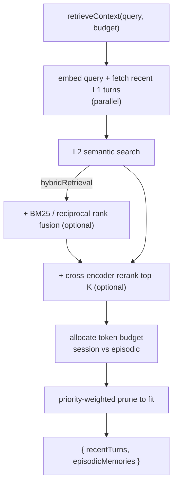

# @actrone/memory

> **Persistent memory for AI agents, so they never forget who you are.**

[](https://www.npmjs.com/package/@actrone/memory)
[](https://www.npmjs.com/package/@actrone/memory)
[](LICENSE)
[](https://github.com/actrone/actrone-memory-ts/actions)

The TypeScript counterpart to [`actrone-memory`](https://github.com/actrone/actrone-memory-py)
for Python. Same two-tier model, same result shapes, same one-import upgrade path.

---


*[Watch the one-minute walkthrough, narrated](https://raw.githubusercontent.com/actrone/actrone-memory-ts/main/media/oss-launch-16x9.mp4)*
*([1:1](https://raw.githubusercontent.com/actrone/actrone-memory-ts/main/media/oss-launch-1x1.mp4) and
[9:16](https://raw.githubusercontent.com/actrone/actrone-memory-ts/main/media/oss-launch-9x16.mp4) cuts.)*

**Give your JS/TS agent a memory in three lines.** Two-tier persistent memory
(short-term session turns plus long-term semantic recall) with a pluggable store
(in-memory by default; Redis/Qdrant adapters) and embeddings. Zero required
dependencies for the on-ramp; MIT licensed.

It's the open-source counterpart to Actrone's governed, hosted memory: when you
outgrow self-hosting, **swap one import** and every call runs through the
governed Orchestrator (PII-tokenised, audited, policy-bounded) with the same API.

```text
  storeTurn ─────────────▶ L1  short-term session turns  (recency, token-budgeted)
  injectMemory ──┐
                 └───────▶ L2  long-term semantic memory  (embeddings)

  retrieveContext(query, budget)
        │  embed query + fetch recent turns (parallel)
        │  → L2 search  (+ optional hybrid BM25/RRF, + optional rerank)
        │  → allocate token budget  → prune to fit
        ▼
  { recentTurns, episodicMemories }   ── prepend to your prompt
```

```bash
npm install @actrone/memory
```

## Quick start

```ts
import { MemoryManager } from "@actrone/memory";

const mm = await MemoryManager.create(); // in-memory + local embedder, no services

await mm.storeTurn("support-bot", "sess-1", "What's your refund policy?", "Within 5 days.");
await mm.injectMemory("support-bot", "The customer is on the Enterprise plan.", 0.9);

const ctx = await mm.retrieveContext("support-bot", "sess-1", "refund enterprise", 4096);
// ctx.recentTurns      : the recent conversation, pruned to the session budget
// ctx.episodicMemories : semantically relevant long-term memories
```

## The one-import upgrade to governed hosted memory

```ts
// Self-hosted (this library)
import { MemoryManager } from "@actrone/memory";
const mm = await MemoryManager.create();

// Hosted + governed (Actrone Orchestrator): same methods, same result shapes.
// Only the import line changes; the rest of your code keeps using `MemoryManager`.
import { ActroneMemoryManager as MemoryManager } from "@actrone/sdk";
const mm = new MemoryManager({ apiKey: process.env.ACTRONE_API_KEY! });
```

## API

`MemoryManager` (all methods async):

| Method | Purpose |
| --- | --- |
| `create(options?)` | Build a manager (in-memory default; pass `l1`/`l2`/`embedder` for Redis/Qdrant/real embeddings) |
| `storeTurn(agentId, sessionId, userMessage, assistantMessage, toolResults?)` | Persist a conversation turn → turn id |
| `retrieveContext(agentId, sessionId, query, tokenBudget)` | Assemble budget-bounded context (4-phase: parallel fetch → allocate → rank → prune) |
| `injectMemory(agentId, content, importance?, sessionId?, topicTags?)` | Write a long-term fact → memory id |
| `searchMemories(agentId, query, limit?)` | Semantic search over long-term memory |
| `deleteMemory(agentId, memoryId)` | Remove a memory |
| `clearSession(agentId, sessionId)` | Clear session turns (long-term memories persist) |
| `getSessionMetadata(agentId, sessionId)` | Session stats, or `null` if expired |

## Pluggable stores & embeddings

The default `InMemoryStore` + `LocalEmbedder` need no services and make the whole
test suite run offline. Swap them for durability + real semantic quality:

```ts
const mm = await MemoryManager.create({
  l1: myRedisStore,       // implements L1Store
  l2: myQdrantStore,      // implements L2Store
  embedder: myOpenAIEmbedder, // implements Embedder
  config: { relevanceThreshold: 0.75 },
});
```

`L1Store`, `L2Store`, and `Embedder` are small interfaces. Implement them against
any backend without touching the manager.

## Privacy and PII: local-first by default, cloud-capable

This library is **local-first by default**: the built-in embedder runs in-process and fact extraction is
opt-in, so with the defaults **nothing leaves your machine**: no API key, no egress. It is also
**cloud-capable**, so you can inject any OpenAI-compatible embedder or extractor.

**Important, and this is exactly where PII protection holds.** The sensitivity classification (`none/low/pii/sensitive`) is
produced *by* the extraction step, and that step (and any real embedder) sees the **raw** text. So PII
protection here holds **only for local models** (in-process or a local Ollama endpoint, so zero-egress). If you
point extraction or embeddings at a **cloud** provider, the raw text, including PII-classified content, is
sent to that provider. This library does **not** tokenise it first.

Actrone's **hosted** platform adds **MAL (Memory Abstraction Layer)**, which tokenises PII *before* any
inference, a structural guarantee that makes **cloud** models safe. Same API (`MemoryManager`), so migrating
is a one-import change. Short form: **local-first by default; cloud-capable; PII stays protected only on local
models; MAL (hosted) makes cloud safe.**

## Framework compatibility

Adapters live in `@actrone/memory/adapters` and are **structural**: none imports its framework at
runtime, so nothing is bundled and the base install pulls only `zod`. Install the framework you use;
the versions below are the optional `peerDependencies` each recipe is tested against (npm warns on a
mismatch). Every framework recipe is CI-typechecked against the current adapter API
(`examples/frameworks/`); run `npx @actrone/memory add <framework>` for a copy-paste recipe.

| Framework | Adapter | Tested peer version |
| --- | --- | --- |
| Vercel AI SDK | `vercelMemory` | `ai >=5 <6` |
| LangChain.js | `langchainMemory` / `langchainChatHistory` | `@langchain/core >=0.2 <2` |
| LangGraph.js | `langgraphMemory` | `@langchain/langgraph >=0.1 <2` |
| Mastra | `mastraMemory` | `@mastra/core >=0.10 <1` |
| LlamaIndex.TS | `llamaindexMemory` / `llamaindexChatMemory` | `llamaindex >=0.8 <1` |
| OpenAI Agents JS | `openaiAgentsMemory` | `@openai/agents >=0.1 <1` |
| Firebase Genkit | `genkitMemory` | `genkit >=1 <2` |
| VoltAgent | `voltagentMemory` | `@voltagent/core >=0.1 <2` |
| Claude Agent SDK | `claudeAgentMemory` | `@anthropic-ai/claude-agent-sdk >=0.1 <1` |
| Cloudflare Agents | `cloudflareAgentsMemory` | `agents >=0.0.1 <1` |
| Inngest AgentKit | `inngestAgentKitMemory` | `@inngest/agent-kit >=0.5 <1` |

**Adapter depth (honest scope).** Most adapters are lightweight, framework-idiomatic
helpers: `recall` returns a governed context string you inject as `system`/`instructions`,
and `remember` persists the completed turn. Two go deeper and implement the
framework's own message-history contract: `langchainChatHistory` (a governed
`BaseListChatMessageHistory` duck-type for `RunnableWithMessageHistory`) and
`llamaindexChatMemory` (the current LlamaIndex.TS `Memory` shape). This is *not* full
parity with the Python library's per-framework memory subclasses; it is the pragmatic
TS surface, and every recipe is CI-typechecked against the current adapter API. The
framework-agnostic core (`recall` / `remember` / `memoryFor`) works with any framework.

## Configuration

`MemoryManager.create({ config })` takes a partial `MemoryConfig` merged over
`DEFAULT_CONFIG`; unset keys keep their defaults. Common knobs:

| Key | Purpose |
| --- | --- |
| `relevanceThreshold` | Minimum L2 similarity for a memory to be recalled. |
| `maxEpisodicMemories` | Cap on long-term memories considered per retrieval. |
| `budgetFractionSession` / `budgetFractionEpisodic` | How the token budget is split between recent turns and long-term memory. |
| `hybridRetrieval` | Fuse lexical (BM25) + dense signals via reciprocal-rank fusion. |
| `relevanceWeight` / `recencyWeight` | Balance semantic relevance against recency in L2 ranking. |

Stores and embeddings are injected, not configured by env. Pass `l1` / `l2` /
`embedder` / `reranker` to `create()`. The defaults (`InMemoryStore` + `LocalEmbedder`)
need no services, so the whole test suite runs offline.

## Architecture

The `retrieveContext` recall pipeline (GitHub renders the diagram):



## Troubleshooting

- **`retrieveContext` returns no `episodicMemories`.** Nothing cleared the
  `relevanceThreshold` (default `0.7`) for that query, or you're on the `LocalEmbedder`
  (a fast, deterministic hash embedder for offline dev; swap in a real `Embedder` for
  production-quality recall). Lower `relevanceThreshold` or inject real embeddings.
- **`TokenBudgetError: tokenBudget must be > 0`.** `retrieveContext` needs a positive
  token budget (e.g. `4096`).
- **Redis/Qdrant not used.** Stores are *injected*, not auto-detected, so pass
  `l1: new RedisL1Store(...)` / `l2: new QdrantL2Store(...)` to `MemoryManager.create()`.
- **`npm warn` about an optional peer version.** Adapters are structural (nothing is
  imported at runtime); the peer ranges only make the tested version machine-legible.
  Install the framework you actually use; ignore the others' warnings.
- **CLI recipe.** `npx @actrone/memory add <framework>` prints an install plus copy-paste
  recipe; `--write <file>` creates one new self-contained file and never overwrites.

## Development

```bash
npm install
npm run typecheck && npm test && npm run build
```

The default `InMemoryStore` + `LocalEmbedder` need no services, so the whole suite runs
offline with no key and no Docker.

## Documentation

| Page | What's in it |
| --- | --- |
| [API reference](docs/api/) | Generated TypeDoc for every export |
| [Framework recipes](examples/frameworks/) | One CI-typechecked example per adapter |
| [Changelog](CHANGELOG.md) | What changed in each release |
| [Contributing](CONTRIBUTING.md) | Dev environment setup and how to submit a PR |
| [Security policy](SECURITY.md) | How to report a vulnerability privately |

## Part of Actrone

`@actrone/memory` is the open-source memory layer behind [Actrone](https://actrone.com), a
platform for running AI agents under governance: durable task execution, tool supervision,
PII tokenisation before inference, and an audit trail.

You never have to adopt any of that. This library is MIT and works standalone forever. If
you do outgrow self-hosting, the migration is the one-import change shown above.

## License

[MIT](LICENSE). Free to use in any project, commercial or otherwise.
