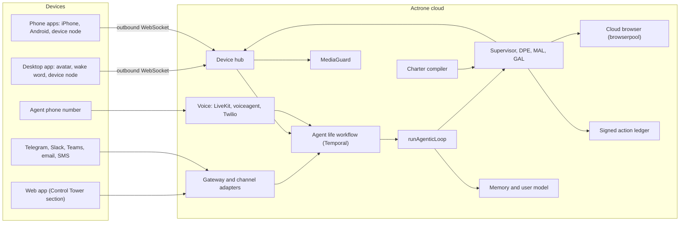

# Actrone personal agents: implementation plan

**Version 1.2, 2026-10-10. Plan only: nothing in this document is built yet.** Version 1.1 added the Actronauts name, characters as the default form, avatar cost tiers, and how employee Actronauts and managed machines work. Version 1.2 makes the phone app native on iPhone and Android, so an Actronaut can know the phone it lives on (decision D25, section 8.6), adds 22 desktop and browser abilities (decision D26, section 8.5), and settles where each piece lives, with the web app as a section of Control Tower and four new repositories (decision D27, section 8.14). Design spec, approved by the owner on 2026-10-04, with the D22 screens approved on 2026-10-09 and the device screens for D25 and D26 on 2026-10-10: [design/personal-agents/actronauts-spec.html](./design/personal-agents/actronauts-spec.html). Owner: Matthew Nyirenda. Audience: the owner (for decisions) and the engineering team (for the build).

Related plans this one builds on: [EMAOP architecture](./EMAOP_Architecture_v1.1.md), [Agent modes and onboarding](./Actrone_Agent_Modes_and_Onboarding_Plan.md), [EMAOP conversational builder](./Actrone_EMAOP_Conversational_Builder_Plan.md), [Governed computer use](./Actrone_Governed_Computer_Use_Plan.md), [Voice capabilities V2](./Actrone_Voice_Capabilities_V2_Plan.md), [Governed action layer strategy](./Actrone_Governed_Action_Layer_Strategy.md) (referenced as GAL below), [Governed skills](./Actrone_Governed_Skills_Plan.md), [Agent scheduling](./Actrone_Agent_Scheduling_Plan.md), [Studio governed tools provisioning](./Actrone_Studio_Governed_Tools_Provisioning_Plan.md), [MediaGuard](./Actrone_MediaGuard_Plan.md).

This plan adds a second edition to the no-code agent builder: alongside today’s enterprise agents, anyone can create an Actronaut (a personal agent with its own name, voice and character), install it on their desktop (always on, summoned by its name) and on their phone (native iPhone and Android apps, or an installable web app, plus its own phone number), and let it act for them across calls, texts, messaging, email, the web and their computer. Every action runs inside a charter the person sets during creation, enforced by the same governance kernel enterprise agents use, so the agent can do far more than competitors allow while producing signed receipts and undo windows for what it did. The builder stops being called EMAOP in the product: it becomes **Studio**, and its first question is whether the agent is for **Work** or **Personal**.

## 1. Decisions (accepted 2026-10-04)

These are the choices that change the build. The owner accepted every recommendation on 2026-10-04, so they are the plan of record. D14 to D20 closed the last open questions the same day (section 18).

| # | Decision | What was decided | Why it matters |
| --- | --- | --- | --- |
| D1 | Product naming | Every agent built in Studio is an **Actronaut** (“get your Actronaut”), the way OpenAI’s are dots, in two editions: **Work Actronauts** and **Personal Actronauts**; agents built in code with the SDK or a framework stay “agents”; the rule set is a **charter**; each Actronaut carries the name its owner gives it (section 3). Chosen by the owner on 2026-10-04 | The web screen found no use of the name; it contains the house brand, so every mention builds Actrone; attorney clearance still needed |
| D2 | Where the agent’s brain runs | Cloud by default (shared Go kernel on Temporal), with the paired desktop app and phone apps as device nodes for local reach | Self-hosted agents (OpenClaw) produced the year’s worst agent security incidents |
| D3 | Mobile form | Revised by D25 on 2026-10-10. The installable web app (PWA) per agent, now a section of Control Tower (decision D27), and the agent’s own phone number stay; native iPhone and Android apps join them in the first release, replacing “no native app in the first release”. For people who use only the web app on iPhone, Add to Home Screen stays a required step and a Siri shortcut gives hands-free “Hey Siri, Mabel” (section 8.6) | A Siri shortcut, a phone number and texts work hands-free without a native app, but knowing the phone itself needs one (D25) |
| D4 | Avatar ambition | A character is the default form, like dots and Muse, drawn as a crew of explorers (an astronaut, an aviator, an aquanaut, a cave explorer, an inventor and a navigator) whose faces are dark glass with two bright eyes, rather than stock robots, toy mascots or real people. Characters are 2D only: pixel-perfect vector rigs on every surface, drawn on the user’s device, with a core form for low power and sleep; no runtime 3D and no photoreal likeness (section 8.8) | Characters appear at 96 to 160 px, where crisp vector art beats 3D; flat 2D fits the monochrome brand; one art pipeline instead of two; files of tens of kilobytes; the same art works in email and notifications; Duolingo ships characterful 2D characters on Rive. Real-time video avatars at $0.37 per minute stay rejected |
| D5 | WhatsApp stance | Official API in the EU and for small-business bots; elsewhere the agent drafts and you send | Meta has banned general-purpose AI assistants on the WhatsApp Business Platform since 2026-01-15 outside the EU order |
| D6 | Sequencing against the OSS adoption push | Start with phase 0 and phase 1 (section 13) as a contained team; hold money and family features until activation data exists | A consumer product is a second go-to-market motion and competes for the same people |
| D7 | Avatar colour (brand question) | The library ships in the monochrome house style; owners may tint one material, treated as their own content; amber and red stay reserved and can never be chosen | Section 8.1.1 governs Actrone surfaces but does not settle whether a user-customized avatar is one |
| D8 | Where the Actronaut lives on the desktop | On screen by default from the first run, perched at a screen edge in its own small always-on-top window; hidden to the tray only when the owner chooses, and its name, hotkey, notifications and approvals keep working while hidden. Closing a window never removes it; Control Tower is the app’s main window, a separate ordinary window, for every account (section 8.5) | A character you have to go looking for is an app, not a presence; keeping the Actronaut and Control Tower in different kinds of window keeps the personal experience uncluttered |
| D9 | How smart an Actronaut is, mind and character | The mind runs on frontier models routed per phase, with the owner’s full context, a plan before acting and a check before reporting success (section 8.13). The character has its own intelligence at two speeds: reflexes on the device for gaze, timing and turn-taking, and judgment from the brain, which writes stage directions with every reply. It never reads faces or voices for emotion and never uses expression to pressure the owner (section 8.8) | A character that only plays canned states is a screensaver; one that reacts to what is actually happening is what makes people keep it on screen |
| D10 | How the desktop character is drawn | Natively: the Rust host draws the same Rive character files on the GPU through Rive’s open-source C++ runtime (MIT licence, with Metal, Direct3D, Vulkan and OpenGL renderers) in a window Tauri 2 hosts; the native phone apps use Rive’s iOS and Android runtimes, and Control Tower (including its Actronauts section) and the browser extension keep Rive’s WebAssembly runtime. The presence core (state machine, presence director and stage-direction vocabulary) is one Rust crate, native on the desktop and the phones and WebAssembly in the browser. A phase 0 spike measures idle memory and CPU against a web-view character and confirms the transparent window on each operating system (section 8.5) | The character is the only surface that runs all day; drawing it natively means no browser engine runs while you are not using Control Tower, the way Zed draws its interface |
| D11 | What the desktop app is | The desktop app is Control Tower, 100%: the same console as the web app, every page and feature, for every account with the features its plan includes. On top of that, the desktop gives Actronauts a richer home: the character on screen, its name and hotkey, the tray, system notifications and computer use on your own machine (section 8.5). Actronauts also work fully in Control Tower on the web, with the character in the page (section 8.5). The phone app is separate and shows only Actronauts, never Control Tower (section 8.6). A personal account is a personal workspace in Control Tower, not a separate app (section 8.2) | One console everywhere, so nothing is learned twice; the desktop app earns its install through the Actronaut experience |
| D12 | Actronauts in the browser | A browser extension, not only a Control Tower tab: Chrome and Edge first, then Firefox, and Safari later because Apple ships Safari extensions only inside an App Store app. It keeps the Actronaut on whenever the browser runs, shows the character in the side panel and in the pages you allow, listens for its name, and from phase P2 acts in your own tabs as a fourth computer use executor (section 8.5) | It is the only browser technology that stays on whatever tabs are open; WebAssembly runs inside it rather than replacing it; Claude in Chrome, generally available since 2026-08-26, shows an agent can ship this way at scale |
| D13 | How Actronauts are sold | Actronauts plans, a product line of their own beside the platform plans: you choose Work or Personal, then a plan. Every plan includes all the apps (desktop app, browser extension, phone app), the channels and plain-language allowances, and asks for nothing technical: no API keys, model choices or setup beyond connecting your accounts. Sign-up to first mission takes about five minutes, with one page that installs the Actronaut on every device already signed in (section 16) | Non-technical buyers need one door, one price and one setup; the platform plans rank developer features on one ladder and gate voice at Scale, which every Actronaut needs |
| D14 | Card issuing partner (phase P4) | Stripe, with Lithic as the fallback. Personal spending uses Stripe’s Link wallet, which issues a single-use virtual card for each agent task with real-time approval, so card numbers never reach the agent or the merchant and Actrone runs no consumer card programme. Work spending uses Stripe Issuing commercial cards funded by the company; apply to Stripe’s private preview for agent issuing now. Money features launch only where these products are available, which must be confirmed before P4 (section 8.11) | One vendor, with billing, Checkout and tax already on Stripe; Lithic covers the case where Stripe’s preview terms or country coverage do not fit |
| D15 | Phone numbers on the free tier (phase P3) | No dedicated number and no outbound pool. Free users call or text one shared Actrone number from their own phone; it recognises them by caller ID, verified once by calling in and saying a code shown in the app. Consequential actions still need an in-app approval, because caller ID can be faked. A dedicated number, and outbound calls and texts to businesses, are on Plus | Free numbers attract abuse, and every sending number needs A2P 10DLC registration; a shared outbound pool gets flagged as spam because of one abuser, and businesses calling back reach a number that is not yours |
| D16 | Launch age (phase P0) | 18+ in every market, with a date of birth at sign-up and stronger age assurance where a market requires it. Teens come later through the household plan, where a parent owns the Actronaut and its charter (phase P6) | Actronauts sign up for things, spend and call, which minors cannot contract for; Character.AI ended open-ended chat for under-18s on 2025-11-25, California’s SB 243 protects minors from 2026-01-01, and the GUARD Act, advanced by the Senate Judiciary Committee on 2026-04-30, would require age verification and bar minors from AI companions |
| D17 | Phone app domain (phase P0) | Revised by D27 on 2026-10-10. `actronauts.actrone.com` stays as the short address people are texted, and it redirects to the Actronauts section of Control Tower rather than serving a separate app; `actronauts.com` is registered defensively and redirected once the name is cleared | One login and one set of passkeys across Control Tower and the phone apps; the installed web app stays Actronauts only because its manifest’s scope is that Actronaut’s section, so no separate origin is needed; every link builds Actrone; people arrive by QR code or a texted link rather than typing it |
| D18 | Launch markets (for all of Actrone, phase P0) | The United States, Canada, the United Kingdom, South Africa and the EU (the EU and Canada added by the owner on 2026-10-09). On 2026-10-09 the owner made these the company-wide wave 1, with waves 2 to 4 for the whole platform, all in `Actrone_Launch_Markets.md`. The EU opens through Ireland and the Netherlands in English, with more member states as their languages land. Prices are in local currency (euro, pound, rand). Kenya follows in wave 2 (after its data-regulator registration) and Nigeria in wave 3 (after the local carrier gateway). Before the EU opens: a GDPR Article 27 representative, AI Act Article 50 labelling (in force since 2026-08-02), and data transfers under the EU-US Data Privacy Framework or standard contractual clauses until an EU region exists | The US and UK carry consumer revenue with native Twilio and Stripe support; South Africa is the Africa plan’s lightest lift, with POPIA already modelled and the Cape Town region keeping data in the country. The EU is the only region where WhatsApp must admit third-party assistants (the European Commission’s interim order of 2026-06-09), and Europe now has a working path for agent payments (section 6.9, item 8). Ireland and the Netherlands are English-friendly and WhatsApp-heavy, so the EU opens without waiting for translation |
| D19 | The character library (phase P1) | Commission it, as spec decision S4 already says: one lead character designer and one Rive animator on work-for-hire terms with full copyright assignment; six hero characters, one per family, for P1 and the other 18 across P2 and P3. No stock packs and no AI-generated final art | Human-made art can be owned and protected (the US Copyright Office’s January 2025 report denies copyright to AI-generated material without human authorship); stock packs are not exclusive and do not follow the crew brief |
| D20 | Cooling-off for loosening the charter (phase P0) | Tiered by the Deterministic Policy Engine tier (0 to 3) that each capability already carries. Low risk (quiet hours, calendar edits, a new watcher) applies at once, with a passkey and a notification on every device. Medium risk (auto-replies to a circle you already have, adding someone to a circle) waits one hour. High risk (raising spend limits, messaging unknown contacts, sharing health, finance or identity data, removing a never item, turning off approvals for consequential actions) waits 24 hours with no bypass. Tightening stays immediate; a pending change shows a countdown, can be cancelled from any device, and sends alerts when it starts and when it takes effect | 24 hours on everything would frustrate the first weeks, when people widen their rules most; no wait on high-risk changes would let someone holding an unlocked phone loosen the rules and act in the same minute |
| D21 | Character names after a trademark register search | A US register search on 2026-10-05 found no marks for Actronauts or Actrone (Bosch’s ACTRON stays the one risk) and replaced three library names: Wilco becomes **Biplane** (the aviator), Grotto becomes **Speleo** (the cave explorer) and Cairn becomes **Binnacle** (the navigator). Lander, Atoll and Lathe stay. The results and the attorney’s remaining work are in `Actrone_Trademark_Clearance_Brief.md`, section 9 | Wilco is the band’s registered mark and a registered pilots’ app; Grotto is registered for AI software; Cairn is crowded with software marks, including a navigation app. The replacements carry no conflicting software marks and no AI products of the same name |
| D22 | Moat and futuristic additions | All fifteen additions from the 2026-10-09 brainstorm join the plan (section 6.9): Rewind, mission preview, shareable proof, the suit that tells the story, verified-agent certification, the Mandate, verified AI caller and sender, payments in Europe, neutrality across ecosystems, work and life in one person’s Actronaut, the crew network with business front desks, a signed skills marketplace, Guardian mode, initiative brought forward, and the Open Charter (timing in D23) | Each passes the moat test: it needs Actrone’s governed system underneath, so a rival cannot bolt it on later; most reuse primitives that are already built |
| D23 | When to publish the Open Charter | Build the charter and receipt formats from phase 0 as a versioned, documented specification, as if they were public, but publish them only after the public launch, once Actronauts have paying customers (about six months after launch). The owner sets the exact trigger and can pull it forward if a regulator, a standards body or a rival moves first | Publishing before distribution would hand rivals the rulebook for free; publishing after traction makes Actrone the reference implementation and the certifier, and building it as a specification from the start makes publishing a decision rather than a project |
| D24 | Actronauts in the hosted launch (pack 1, about Q1 2027) | The whole plan ships in pack 1, phases P0 to P7, except its two marketplaces (signed skills and Actronaut characters), which ship with the marketplace in pack 2. That includes the native iPhone and Android apps (decision D25), the desktop app with the Control Tower window, the browser extension, governed computer use, the Actronaut’s own number with voice calls, payments, households, Guardian mode, the crew network and managed machines. Payments switch on only where decision D14’s partners are confirmed, and households launch with adult members only (decision D16). Anything that misses its gate on launch day ships in pack 2 rather than delaying the launch (`Actrone_Phased_Launch_GTM_Plan.md`, section 0.1). Revised by the owner on 2026-10-09, replacing a smaller launch slice | Voice agents and personal agents are where the market is in early 2027, and everything is built before launch as one plan, so it launches together. Section 13 estimates about 69 to 85 weeks for one team, or about 37 to 45 weeks along the longest chain (P0, P1, P2, then P7) with the other phases in parallel, against about 25 weeks to the end of Q1 2027; holding the date needs the phases built in parallel, and the slip rule covers the rest |
| D25 | Native phone apps (phase P0, in pack 1) | Native iPhone and Android apps ship in pack 1, still showing only Actronauts (D11). One app holds the owner’s whole crew, and each Actronaut gets its own widgets, its own name for Siri and Google, and its character as an alternate app icon. They are built in Swift with SwiftUI and in Kotlin with Jetpack Compose around the shared Rust core (through UniFFI bindings), with Rive’s native runtimes so the character matches every other surface; Tauri is not used on phones. The installable web app stays as the no-install way in, as a section of Control Tower (decision D27). The apps add what phones give only to native apps (senses, hands, presence and an on-device brain, section 8.6), each off until the owner turns it on. Payment stays on the web (section 16.5). Decided by the owner on 2026-10-10 | Phones close nearly every way of knowing them (notifications, places, call screening, the Lock Screen, Siri) to web apps. Most of that access lives in widget, keyboard, call and notification extensions written in Swift and Kotlin, which Tauri’s web view does not build |
| D26 | New desktop and browser abilities | Twenty-two additions join the plan (section 8.5). On the desktop: working beside you without taking the pointer, select and ask, files that file themselves, meeting notes without a bot, notification sorting on Windows, a focus guard, the computer’s own search, on-device models, continuing anywhere, show and tell, and desktop widgets. In the browser: site tools before clicks (WebMCP), a checkout guard, a scam guard, attacks shown as they happen, forms from the vault, your tab or the cloud, research across tabs, the address bar and right-click, help inside the sites you use, private pages kept on the computer, and meeting notes in the browser. Approved by the owner on 2026-10-10 | Each uses what the desktop and the browser offer that the phone and the cloud cannot, and each runs through the same leases, charter and receipts, so it adds reach without adding a new way to fail |
| D27 | Where each piece lives | The web version of the Actronauts phone experience becomes a section of Control Tower (`/a/[agentId]` in `frontend/apps/control-tower`) with its own root layout, its own small bundle and a per-Actronaut manifest scoped to that section, replacing the separate `frontend/apps/actronauts` app; `actronauts.actrone.com` redirects to it. Everything that is not a web page gets its own repository: `actrone-desktop` (the Tauri app and Rust device host), `actrone-browser` (the extension), `actrone-mobile` (the iPhone and Android apps) and `actrone-presence` (the shared Rust core and the character files). New endpoints stay in the orchestrator (section 8.14). Decided by the owner on 2026-10-10; the four repositories exist on GitHub under `actrone/`, private | Actronauts on the web already live in Control Tower, so a second web app would add a deploy, a sign-in boundary and a self-hosting package for no gain once the native apps exist. The four repositories each ship through a different gatekeeper (desktop installers and updater, browser stores, App Store and Google Play, versioned library releases), so their release schedules stay independent |

## 2. What shipped in 2026 and what it teaches

Personal agents became the main consumer AI battleground in 2026: Meta launched Muse on 2026-09-08, OpenAI launched dots on 2026-09-29 and Hark launched Hark Pro on 2026-10-06, all within a month. The table records what each competitor ships today and the gap Actrone can use.

| Product | Launched | Where it runs | How you reach it | Governance it ships | Gap for Actrone |
| --- | --- | --- | --- | --- | --- |
| OpenAI dots | DevDay, 2026-09-29 | A cloud computer per dot, GPT-6 Astra | ChatGPT, text messages, Slack, Teams, phone calls; 4,000+ apps through plugins | Saved passwords hidden from the model; background tasks read-only; built-in and custom approval rules | One dot at launch, Pro and Business Premium only; OpenAI models only; no signed proof or undo |
| Hark Pro | 2026-10-06 (hardware planned for 2027) | Hark’s Handoff cloud, running several browsers at once | Web, iOS, Android; United States only at launch | Credentials in an encrypted vault Hark says it cannot read; no published approvals, spending limits, receipts or undo | Proactive (it spots a booked flight with no hotel) and backed by a $700 million raise, but no answer yet for paying in Europe; free, $20 and $100 tiers |
| Meta Muse | 2026-09-08 | Muse Secure VM per person; a “Sentinel” agent approves anything leaving the VM | Muse app (iOS, Android, web, Mac) and WhatsApp; glasses announced | Per-app access levels, asks before email or purchase, audit trail, “forget”; user-keyed Confidential VM announced | Locked to Meta; Amazon has blocked it; no work edition; trust in Meta’s data handling |
| Google Gemini Spark | Google I/O, May 2026 | Dedicated Google Cloud VM, Antigravity harness, Gemini 3.5 | Its own Gmail address, Chrome | Checks in before major actions | Gmail, Calendar, Docs, Drive and three MCP apps at launch |
| Anthropic Claude Cowork | Preview 2026-01-12, GA 2026-04-09, mobile and web July 2026 | Claude desktop app, folder-scoped | Desktop, mobile, web | Folder scoping, progress updates | Max plan ($100 to $200 per month); Claude only; no phone or messaging presence |
| Nous Research Hermes Agent | February 2026, open source | Self-hosted | Telegram, Discord, Slack, WhatsApp, Signal, email, CLI; iMessage through BlueBubbles | Left to the operator; self-written skills | Security is the user’s problem; huge demand proves the category (top of OpenRouter’s app rankings per secondary reports) |
| OpenClaw | Early 2026, open source | Self-hosted gateway plus paired device nodes | Messaging apps; computer use on nodes | Gateway is the chokepoint; no per-action confirmation once computer control is armed | 40,000+ exposed instances, 1,800+ leaking keys, 14 malicious skills on ClawHub in three days, an agent that ignored “STOP” while deleting email |
| Microsoft Copilot | Mico avatar October 2025; Copilot Actions | Windows agent workspace (a separate desktop); MCP agent connectors in an on-device registry | Windows, “Hey Copilot” | Contained workspace, consent prompts, Intune policy | Mico was removed from voice mode on 2026-08-13 |
| Apple Siri | WWDC, 2026-06-08 | On-device models plus a custom Gemini in the cloud | Apple devices | On-device privacy | App Intents only; Apple ecosystem only |
| Amazon Alexa+ | All US Prime members, 2026-02-04 | Amazon cloud | Echo devices and app | Not documented as a feature | Home-centric |
| xAI Grok companions | July 2025; retirement announced 2026-07-24, removal from 2026-09-01 | Real-time 3D avatars with low-latency voice | Grok app | Weak; guardrails bypassed in testing | Per secondary reporting: real-time 3D and voice used large compute; 40% more downloads but 9% more revenue; harassment in 34% of interactions |

Seven lessons shape the design:

1. **The brain moved to the cloud.** Muse, dots and Spark all run the agent in an isolated cloud machine so it keeps working when your laptop is closed. Local-only agents gave attackers 40,000 exposed doors. Actrone runs the agent on its governed cloud kernel and treats the desktop as a paired, revocable device.
2. **Everyone claims governance, nobody proves it.** Muse has an egress gate and an audit trail; dots has approval rules. None of them sign receipts, simulate a write before committing it, or undo a completed action. Actrone already has all three in the GAL.
3. **Decorative avatars die.** Grok’s companions used more compute than they earned, and Mico left Copilot’s voice mode. An avatar has to earn its pixels by showing what the agent is doing, waiting for and refusing, it has to render on the user’s own device, and it has to fall back to cheaper forms when the device or the moment calls for it.
4. **Proactivity annoys unless it is budgeted.** OpenAI paused ChatGPT Pulse in December 2025, and user studies call constant suggestions distracting. Actrone gives initiative a budget the person controls.
5. **Platforms wall agents off.** WhatsApp banned general-purpose assistants from its Business Platform, Amazon blocked Muse, Instagram’s personal-account API is gone, and X charges $0.20 for an API post with a link. Actrone signs its web traffic, respects site rules, prefers official channels and owns two channels outright: the agent’s phone number and its installed app.
6. **Skills are a supply chain.** Malicious ClawHub skills stole data in January 2026. Actrone skills are signed, version-pinned and capped by the agent’s granted capabilities.
7. **Regulation arrived.** The EU AI Act’s chatbot disclosure duty applies from 2026-08-02, California’s companion chatbot law (SB 243) from 2026-01-01, AI voices count as artificial voices under the Telephone Consumer Protection Act (TCPA), and seven US states protect voices against unauthorized clones. Actrone’s voice stack already speaks disclosures and gates cloned voices on consent.

## 3. Naming: Actronauts, Studio and the charter

The market-facing name has to be catchy and ownable, the way OpenAI calls its agents dots. The names inside the product have to be precise. The recommendation separates the two.

**Actronauts** is the name for every agent built in Studio, at work and at home: “get your Actronaut”, “Mabel is my Actronaut”, “our support Actronaut answered 400 tickets overnight”. The owner chose it on 2026-10-04 from a final shortlist of Actronauts, Cyborgs and Cybies. It works for four reasons:

- **It says what the product does**: an astronaut goes where you can’t and carries out the mission you set; an Actronaut goes into calls, inboxes, websites and apps on your behalf, under your charter
- **It owns its name**: the word contains the house brand, so every mention builds Actrone, and the web screen found no use of it anywhere
- **It keeps the edge without the menace**: the characters are a crew of explorers with glass faces, each with a lifeline back to base and charter lights on the suit, in porcelain, silver, graphite and onyx. That carries the tech feel of “cyborg” while staying warm and capable, and it avoids the toy look critics flagged in Muse’s mascot
- **It is memorable**: it rides on a word everyone already knows, and the plural works the way “dots” does

Usage rules keep the name protectable:

- Write it capitalized every time, as a product noun: “an Actronaut”, “your Actronauts”. A capitalized brand resists becoming a generic word
- Never shorten it to “naut” or “Acts” in product copy
- Attorney clearance in classes 9 and 42, plus domain and app-store handle checks, still come before public use; the screen covered the web, not trademark registers

How the names fit together:

- **Actronaut** is what people create in Studio, talk about and see on their desktop, in either edition. Each Actronaut carries the name its owner gives it. On the phone, its widgets and notifications show that name and the owner’s character, the native app’s icon can switch to the character, and an Actronaut installed from the web app gets its own home-screen icon with its name; the desktop app’s tray icon shows the character’s face. Agents built in code with the SDK or a framework stay “agents”; they can opt into an Actronaut presence (a character and the desktop app) later
- **Studio** replaces “No-code (EMAOP)” on the build-mode chooser and the fleet filter in Control Tower, and the fleet badge on Studio-built agents reads “Actronaut”. EMAOP stays as the internal codename in code identifiers and architecture docs, so no stored data changes
- **Work** and **Personal** are the two editions, chosen as Studio’s first step: “Who is this Actronaut for?” Both editions are Actronauts, so a company’s support Actronaut and an employee’s own Actronaut share one crew, one desktop app and one brand
- **Charter** is the user-facing name for an Actronaut’s rules: what it may do on its own, what it must ask about, and what it must never do

Using one name for both editions is deliberate. Employees meet Actronauts at work and want one at home, and consumers who already have one recognize it when their employer rolls one out, so each edition markets the other. Enterprise copy can still say “governed agents” where procurement language needs it, with Actronaut as the product name.

Tagline candidates: “Get your Actronaut.”, “Send your Actronaut.” and “Name it. Shape it. Charter it.” The theme allows a light mission vocabulary where it stays clear (a task can be a mission, the timeline can be the mission log), while governance terms such as charter, approval and receipt stay literal.

Other finalists screened before Actronauts:

| Finalist | Meaning | Problem found |
| --- | --- | --- |
| Cyborgs | Part you, part machine | Mad Catz owns CYBORG for game controllers (US serial 75408686) and for mice, keyboards and headsets (US serial 77375838); DC Comics has a character called Cyborg; the word can feel menacing for a trust product |
| Cybies | Cyborg plus buddies | Clear apart from i-Cybie, a robot-dog toy sold from 2000 to 2006, but it reads young for an adults-only product |
| Buddies | A friendly helper | “Buddy” is already an AI agent built into Safari, and Buddy.FM is an AI friend app; the word also invites the companion-chatbot classification California and New York regulate |
| Moons | Silver on black, always near you | Set aside by the owner for a stronger name |
| Aido | “AI do” and “I do” | Clear of agent products, but a coined brand rather than a dots-style word |
| Alts | An alternate you | Alt Inc. already sells personal AI and “AI clones” |
| Synth | A synthetic person | “Synth” (a Y Combinator agent-tooling company) and “Synths” (an agent company building digital humans with voice) |
| Exo | An exoskeleton that extends you | ExoSynth, an AI voice agent platform |
| Droid, Android | Robot helpers | Lucasfilm and Google trademarks |
| Actroid | Close to Actrone | An existing humanoid robot brand |
| Orbs | A round default form | An agent sandbox company sells “orbs”, and Worldcoin’s iris-scanning Orb carries privacy baggage |
| Stead | Acts in your stead | AgentStead already sells hosted OpenClaw agents under a near-identical name |
| Wilco | Radio code for “will comply” | A developer learning platform whose team joined Lemonade, plus the band |
| Owls, elves | Work at night | Owls are omens of death or witchcraft in many sub-Saharan cultures; “Elf on the Shelf” makes an always-on elf read as surveillance |

Plain nouns for “an agent that acts for you” were screened first. Every one collided with a live product or carried a cultural risk in launch markets:

| Candidate | Problem found (2026 web screen, not a register search) |
| --- | --- |
| Delegate | Yutori Delegate (personal web agent, April 2026) and UiPath Delegate (desktop agent) |
| Envoy | Envoy Inc. workplace software, an “Envoy” agent-builder app, and the Envoy proxy inside our own gateway |
| Steward | Sendbird Agent Steward (May 2026) and Steward AI (compliance software) |
| Agency | Agency (agen.cy), maker of AgentOps, in the same agent tooling market |
| Orbit | Anthropic’s Orbit assistant, an “Orbit” floating desktop companion app with characters, and Orbits (household agent) |
| Understudy | An open-source desktop agent that learns by demonstration |
| Kin, Twin | Existing personal AI products |
| Familiar, daemon, genie | Spiritual meanings: “familiar spirits” is a biblical term with strong negative weight in Nigeria, Kenya and South Africa, and jinn are religious in Egypt, all named in the Africa launch plan |
| Companion | California SB 243 and New York’s law regulate “companion chatbots”; the product should not invite that classification in its name or copy |
| Any “Actron-” form | ACTRON is a registered Bosch mark (US serial 78249215), already the main risk flagged in the [trademark clearance brief](./Actrone_Trademark_Clearance_Brief.md) |

Run Aido and any later candidate through the [trademark clearance brief](./Actrone_Trademark_Clearance_Brief.md) process before public use.

## 4. Product principles

These principles decide trade-offs during the build. When two features conflict, the earlier principle wins:

1. **Your rules are enforced, not suggested.** The charter compiles into the Tool-Call Supervisor’s tool allowlist, the Deterministic Policy Engine (DPE) and GAL commit policies. It never lives only in a system prompt
2. **Proof over promises.** Every consequential action produces an Ed25519-signed, hash-chained receipt, and every reversible action gets an undo window
3. **Always on, never unaccountable.** The agent listens for its name and runs scheduled work around the clock, and a spoken “stop” or a hotkey halts it on the device without waiting for the cloud
4. **It lives where you live.** Desktop, phone, the agent’s own number, messaging, email and the web, with one memory and one charter across all of them
5. **It learns you and shows its work.** Everything the agent believes about you is visible, sourced, editable and deletable
6. **Presence has a purpose.** The avatar always reflects a real state; idle animation never fakes work
7. **Autonomy is earned.** The agent proposes widening its own permissions only after a track record you approved, and widening never happens silently
8. **Open by default.** Any model through the gateway, export of all your data, and agent-to-agent (A2A) interoperability with other people’s agents

## 5. The experience, end to end

The scenarios below are the “awe moments” the first releases must make real. Each lists what the person experiences and the governance that makes it safe to allow.

| Moment | What you experience | What keeps it safe |
| --- | --- | --- |
| The plumber | “Mabel, get a plumber here tomorrow morning, under $150.” Mabel calls three plumbers from its own number, compares quotes, books one, adds it to your calendar and texts you the confirmation | Calls disclose AI at the start; spend under the charter limit; the booking has a signed receipt and a cancellation undo window |
| Inbox to zero | You wake to a sorted inbox, drafts written in your style, and four replies already sent to people in your “family” circle | Auto-send only to circles the charter allows; everything else waits for a tap; drafts never include data from purpose-bound classes such as health |
| On hold for you | Mabel calls the airline, sits through 40 minutes of hold music, rebooks your flight within the fare difference you allowed, then rings you to confirm | Fare difference above the threshold needs a passkey approval; the call transcript is redacted before storage |
| The meeting double | You cannot make a 3 pm call; Mabel joins, announces itself as your AI assistant, listens, answers only from your briefing and brings back action items | Meeting consent gate and disclosures already exist in the voice stack; the DPE checks every sentence before it is spoken |
| Watch and pounce | A visa appointment slot opens at 02:14; Mabel books it and leaves you a morning summary | A watcher with a pre-approved booking mandate; the receipt shows exactly what was submitted |
| Show it once | You record yourself filing an expense report once on your desktop; next month Mabel does it and asks only before submitting | The recording becomes a signed skill draft; its steps cannot exceed the charter’s capabilities |
| Ask about your screen | “Mabel, what does this error mean?” Mabel reads the window you are looking at and answers | Screen frames pass through MediaGuard redaction before any model sees them; password managers and banking apps are excluded by default |
| Drop to delegate | You drag a PDF onto the avatar; it offers “summarize, file, or pull out the dates” | Files only enter scoped folders; the action menu reflects only what the charter allows |
| Small business front desk | Your bakery’s agent answers the shop’s WhatsApp Business number, takes orders and chases an unpaid invoice | Structured business bots are permitted on WhatsApp; money requests follow GAL approval rules |
| Agents negotiating | Mabel and a colleague’s agent agree a meeting time without either of you writing a message | A2A with signed delegation tokens; each side reveals free/busy only |
| The bridge to work | “Move my dentist appointment so it doesn’t clash with work.” Mabel reads your work calendar’s free/busy through your company’s work agent | Your organization’s policy decides what crosses; personal data never flows into the work tenant |
| Stop means stop | Mid-task you say “Mabel, stop.” The cursor freezes between keystrokes and every running task cancels | Local wake word and kill switch work offline; the cloud revokes the device lease within seconds |

Some things a human can do stay human by law or platform terms: signing legal documents in your name, solving CAPTCHAs, passing identity verification and voting. For these the agent prepares everything and hands over a “take over” view.

## 6. Capability brainstorm by pillar

Each pillar lists features, the phase that delivers them (section 13) and the existing primitive each one reuses. Reuse is what makes this buildable: most of the hard governance code already ships behind flags.

### 6.1 Pillar A: the charter

The charter is the product’s core, the place where a person turns “do everything” into “do everything I’d allow”.

- **Plain-language authoring** (P0): you say “never text my ex, ask before spending over $20, handle family emails yourself”; a schema-constrained model call proposes charter entries and the deterministic compiler decides. Reuses the “LLM proposes, compiler decides” rule from the conversational builder plan
- **Three lists** (P0): on its own, ask me first, never. Every capability lands in exactly one list per contact circle
- **Contact circles** (P0): family, friends, work, services, unknown. Permissions differ per circle; an unknown number never gets an outbound call without approval
- **Spend controls** (P4): per day, per merchant, per category, approval threshold. Compiles to GAL money-class commit policies
- **Data classes** (P0): health, finance, children, location, identity documents. Each class binds to purposes through GAL purpose binding, so the travel task never reads your health notes
- **Quiet hours and focus** (P1): the agent only speaks or notifies during allowed windows; urgent exceptions are explicit
- **Autonomy presets** (P0): careful, balanced and hands-off templates that fill the three lists, editable afterwards
- **Charter rehearsal** (P0): “what would Mabel do if a stranger texts asking for your address?” Runs scenarios in a sandbox, always including a refusal case, before the agent goes live. Reuses the conversational builder’s adversarial sandbox
- **Cooling-off for loosening** (P0): tightening applies immediately. Loosening is tiered by risk (decision D20): low-risk changes apply at once with a passkey, medium-risk changes wait one hour, and high-risk changes wait 24 hours with no bypass. An attacker who takes over an account cannot loosen the charter and act in the same minute
- **Trust ladder** (P5): after 12 approved replies to Mom under 50 words, Mabel asks “should I send these myself?” Widening only happens with your yes. Reuses the assurance refinement flywheel, which today only proposes tightening
- **Lethal-trifecta guard** (P2): when one task has read private data, ingested untrusted content (a web page, an inbound email) and is about to send something outward, it needs approval even if the charter allows the send. Uses GAL provenance to track what the task touched
- **Signed receipts and a readable timeline** (P0): “what did you do today” renders the GAL ledger in plain language
- **Undo windows** (P2): email sends are delayed by a configurable window, calendar changes revert, cancellable orders cancel. Reuses GAL compensating actions and the TTL sweeper. Rewind (section 6.9) puts all of them behind one button
- **Kill switch** (P1): voice, hotkey, tray menu and a big button in the phone app. One action cancels all running tasks and revokes device leases

### 6.2 Pillar B: presence and the avatar

Presence is the reason people keep a personal agent open all day. It must be delightful and it must carry information.

- **The Actronaut crew** (P1): dots (bubbly shapes such as a pear in glasses) and Muse (a plush mascot called Jolly) proved characters make an agent feel personal, and reviewers called Muse’s toy look infantilising for an adults-only product. A logo-shaped species was the next draft and felt abstract. Actronauts are a crew of explorers instead: people recognize an astronaut, a diver or a pilot at a glance, and no agent product dresses its characters as a crew from every frontier. Six traits make the crew Actrone’s own:

| Trait | What it looks like | Why |
| --- | --- | --- |
| Glass face | Every Actronaut’s face is dark glass with two bright eyes, whatever it wears | Relatable eyes without a human likeness, and no skin tone to get wrong |
| Explorer outfit | Each family dresses for a frontier and a job: a spacesuit, a flight hood and goggles, a diving helmet, a caver’s hard hat, an inventor’s apron, a navigator’s coat | Roles people recognize at a glance, invented for Actrone rather than taken from a real person |
| Lifeline | Every explorer keeps a line to base: a spacewalk tether, a radio cord, a diver’s air hose, a climbing rope, a power cable, a mooring line. It pays out while the Actronaut works away and reels it home when you say stop | A visible promise that it never acts out of your reach |
| Charter lights | Three lights on the chest for on its own, ask and never; ask holds amber while it waits for you, never holds red when it is blocked | Governance worn on the suit |
| Mission patch | The Actrone mark as a small shoulder patch; Work Actronauts add the organization’s patch on the other shoulder | The brand rides on the suit, not in the body shape |
| Receipt stitches | Suit quilting and seams drawn as rows of small marks, one per signed receipt | The signed action ledger, made visible |

- **Six launch families** (P1): Lander the astronaut (the default, for everything), Biplane the aviator (calls and messages, with a radio headset), Atoll the aquanaut (deep work in the inbox and long documents), Speleo the cave explorer (research and browsing, with a headlamp), Lathe the inventor (automations, forms and skills, with tools) and Binnacle the navigator (travel, calendars and logistics, with a spyglass). Owners rename their Actronaut; these are library names. Library names are screened against AI voice, model and assistant names: Sol and Marin (the first draft) are OpenAI voices, Skye sounds like OpenAI’s withdrawn Sky voice, Rivet is Ironclad’s AI agent IDE, Kai is Kasisto’s banking assistant, Lumi and Axel are assistant apps, and Remy is Google’s personal agent codename. A US trademark register search on 2026-10-05 replaced three more: Wilco (the band’s registered mark, and a registered pilots’ app), Grotto (registered for AI software) and Cairn (crowded with software marks, including a navigation app) became Biplane, Speleo and Binnacle (decision D21). Each name still needs attorney confirmation, including outside the US. The library grows to 24 designs (a polar explorer, a mountaineer, a field botanist and more), commissioned from human artists on work-for-hire terms (decision D19), each built as a 2D vector rig with still poses for email and notifications, owned outright, in porcelain, silver, graphite and onyx. Colour customization is decision D7
- **Real astronauts and inventors, considered**: famous people would make instant characters but cannot be used. The living need consent under the right of publicity, and the dead are protected too in 23 US states, for up to 100 years after death in Indiana and Oklahoma. Estates enforce it: Hebrew University, which owns Einstein’s name and likeness, sued General Motors over an advertisement, and CMG Worldwide licenses Amelia Earhart. NASA’s insignia is protected and NASA does not endorse products. An agent speaking as a real person would also put words in their mouth and fall under the EU AI Act’s labelling duty for content that resembles real people. The crew borrows eras and gear instead (1960s spacesuits, classic diving helmets, early aviation), which nobody owns
- **Directions ruled out**: robots with antennas and dot eyes, animal ears, screen faces, plush and food mascots, photoreal human likenesses, logo-shaped figures, and planets or orbs. Single astronaut mascots already exist (Postman’s “Postmanaut”), so the distinction is the whole crew and its governance gear, not the spacesuit alone
- **The core form** (P1): the helmet alone, round and glass-faced, with the charter lights, used for low power, focus sessions and quiet hours; it is the existing Aura Canvas 2D renderer, restyled
- **Customization** (P1): materials within the house palette and accessories such as a headset for calls, a scarf or a field satchel, through rig variants; later a marketplace of signed character packs (P6)
- **States you can read** (P1): idle, listening, thinking, working, waiting for approval, blocked, speaking, away and sleeping. Waiting for approval holds an amber outline with the approval card beside the avatar; blocked holds a red outline. The owner’s colour choices cannot override these, the same rule the Aura orb already enforces
- **A character that understands** (P1): the character reacts to meaning, not to a timer. It looks at the window you are talking about, nods while you speak and stops the moment you talk over it, looks concerned when a payment fails and pleased when a booking lands, and raises a hand instead of interrupting when its news can wait. Section 8.8 sets out how its reflexes and judgment work and the rules that keep it honest
- **Useful idle behaviour** (P1): the avatar turns toward a new notification, glances at an upcoming calendar card ten minutes before a meeting, waves when you come back and shows a “while you were away” card. When memory consolidation actually runs it sorts cards; when a cloud task runs it carries a task card off-screen and returns with the result. When nothing runs it rests
- **Playful touches** (P1): poke reactions, a stretch in the morning, a sleeping pose in quiet hours that wakes only to its name, a small celebration when a long task finishes. All of it can be turned off
- **Drop to delegate** (P1): files, links and text dragged onto the avatar open an action menu filtered by the charter
- **Good manners on screen** (P1): the avatar never covers the cursor’s work area, snaps to screen edges, follows you across monitors, and hides automatically during screen sharing, presentations and fullscreen apps
- **Multiple agents** (P6): each agent has its own avatar; when Mabel hands a task to your business agent, you see the hand-off
- **Your own crew member** (P6, behind consent): an Actronaut styled from your photo (suit, build and accessories, never your face), with the source photo deleted after styling and biometric consent recorded
- **Reduced motion and low power** (P1): the core form (Canvas 2D, built on the existing Aura renderer) replaces a character when reduced motion is on, on battery saver, or on devices below the performance floor; section 8.8 lists the tiers and their costs

### 6.3 Pillar C: reach

Reach covers every surface where the agent can hear you and act, with the constraints that apply to each.

- **Desktop app** (P1): Windows, macOS and Linux; Control Tower on the desktop with the always-on character, wake word, approvals and the device node for computer use, plus select and ask, watched folders, meeting notes without a bot and the other desktop abilities in decision D26
- **Any browser** (P1 and P2): the Actronauts browser extension keeps the Actronaut on whenever the browser runs, in the side panel and the pages you allow, and from P2 acts in your own tabs, with the checkout and scam guards, site tools before clicks and the other browser abilities in decision D26; Control Tower in a tab shows the character too, with no install (section 8.5)
- **Phone apps** (P0, deepening through P5): native iPhone and Android apps that show only Actronauts (decision D25), plus an installable web app per Actronaut. With the owner’s permission they know the phone: places, routines, Focus, health, notifications and the current screen on Android, and calls to your own number on Android. They also put the character in the Dynamic Island, on the Lock Screen and in an Android bubble, and draft replies inside any app through the Actronaut keyboard (section 8.6)
- **The agent’s own number** (P3): you call it, text it, forward unknown callers to it for screening, and it calls businesses for you
- **Messaging** (P0 to P2): Telegram (including replying from your own account through Telegram Business), Slack, Teams, email, SMS, iMessage through a paired Mac, WhatsApp within Meta’s rules (section 8.7)
- **The web** (P2): a persistent, governed cloud browser per agent with your logins sealed in the vault, plus your own browser on the paired desktop when you allow it
- **Anything with an API** (P0): the MCP catalog (about 29 servers with OAuth 2.1, PKCE and token refresh), custom REST connectors with OpenAPI import, and A2A for other agents
- **Your local tools** (P2): the device node bridges to MCP servers running on your machine (note apps, local databases, IDEs), so “plug into anything” includes things only your laptop can reach
- **Anything with a screen** (P2): governed computer use as the universal fallback, authorized per element (role and accessible name), never per pixel coordinate
- **Wearables** (P1, then later): an Apple Watch app for glances and low-risk approvals in P1, with Wear OS later; glasses and earbuds reach the agent through its phone number and the phone app’s audio

### 6.4 Pillar D: mind

The mind is what makes the agent personal rather than generic. It needs depth and full transparency.

- **Personal knowledge graph** (P5): people and relationships, places, organizations, commitments you made, preferences, routines and documents, stored in Postgres with vectors in Qdrant through the existing memory service
- **Sensitivity tags on every fact** (P0): the `none`, `low`, `pii` and `sensitive` tags from `actrone-memory`, so you decide what reaches a hosted model
- **“What Mabel knows about me”** (P0): every fact with its source message and date, edit, forget and export
- **Style profiles** (P5): how you write to each person, used for drafts; built by a background deriver in the spirit of Plastic Labs’ Honcho, governed so inferred traits are visible and deletable, and so health, religion, sexuality and other special categories are never inferred
- **Routine detection** (P5): “you reorder coffee every three weeks; shall I watch for it?”
- **Teach by showing** (P2): record a task on your desktop; the device node captures the accessibility-tree steps (not raw video) and Studio turns them into a governed skill draft for your approval
- **Self-improving skills, governed** (P5): when Mabel solves a new task well, it proposes saving the procedure as a skill; the skill is signed, pinned and capped by the charter
- **Private vault** (P5): for chosen data classes, the decryption key only unwraps with your passkey through the WebAuthn PRF extension, so those memories stay unreadable to Actrone while you are away. The trade-off is explicit: the agent cannot use them unattended
- **Local brain option** (P5): a model on your own machine reached through the existing Edge Connector tunnel, for people who want inference to stay local

### 6.5 Pillar E: initiative

Initiative separates an agent from a chatbot, and budgeting it separates a helpful agent from Clippy.

- **Watchers** (basic set P2, full set P5): price drops, appointment slots, restocks, package tracking, bill due dates, topics you follow. They compile to Temporal schedules through the existing `agentschedule` package or to provider push subscriptions. The basic set (bills, packages, appointment slots, and gaps such as a flight booked with no hotel) ships in P2 so launch matches Hark Pro’s anticipation; every suggestion cites its source and takes one tap (section 6.9, item 14)
- **Interruption budget** (P5): a default of three interruptions a day, everything else goes to a digest. The budget adapts to what you accept and dismiss
- **Context-aware delivery** (P5): the desktop app reports “in a meeting”, “presenting” and “focused” (fullscreen) states; non-urgent items wait
- **Morning brief and evening wrap** (P1): the avatar speaks the brief at your desk, or Mabel calls you during your commute (P3); the evening wrap lists receipts and anything that still needs you
- **Ask once, remember** (P0): a preference given in any channel applies everywhere

### 6.6 Pillar F: teamwork

Teamwork turns one agent into a household and connects it to the rest of your life, which no single-vendor competitor can do.

- **Several agents per person** (P6): a life-admin agent, a business agent, a study agent, each with its own charter, coordinating through the Multi-Agent Coordination Protocol (MACP) that already ships
- **Households** (P6): a shared family agent with a charter per member, parents as owners, and children’s accounts with stricter defaults
- **Personal to work bridge** (P6): your personal agent asks your company’s work agent for free/busy or a document you are entitled to, through the cross-org action fabric with signed requests and receipts on both sides. Your organization’s policy decides what crosses
- **Agent-to-agent with other people** (P6): Mabel negotiates a time with a friend’s agent through A2A, revealing only what both charters allow
- **Human hand-off** (P2): when the agent meets a CAPTCHA, a two-factor prompt or an ambiguous choice, it sends you a live “take over” view of the browser session and resumes after you act

### 6.7 Pillar G: personal business

Solo founders, freelancers and small shops sit between the two editions, and they are the most likely to pay.

- **Business templates** (P2): quotes, invoices, bookings, customer replies, review responses, social posting with approval
- **WhatsApp Business number** (P2): permitted because a booking and order bot is a structured business bot under Meta’s rules
- **Payment chasing** (P4): reminders and payment links within GAL money rules
- **Graduation path** (P7): a personal workspace upgrades to a team and then to the Work edition without rebuilding agents, because both editions share one manifest format

### 6.8 Pillar H: safety and wellbeing

Safety features are a reason to choose Actrone, so they are designed as product, not as fine print.

- **Not a companion product** (P0): no romantic or sexual personas, no simulated emotional dependence, AI disclosure at the start of every conversation and every call, and crisis referral when a conversation shows risk of self-harm, meeting the stricter of SB 243 and New York’s rules everywhere
- **Age rules** (P0): 18+ in every market (decision D16), with a date of birth at sign-up and age assurance where a market requires it; households with child accounts in P6 with age assurance and parental controls
- **Your own cloned voice only** (P3): the agent may speak in your cloned voice only with a consent record in the existing `voiceclone` vault, and never without disclosing that it is an AI
- **Anti-abuse** (P0): no impersonating other people, outbound calls only to your contacts or numbers you named, rate limits per day, recording consent by jurisdiction
- **Screen privacy** (P2): screenshots are model-only, excluded apps are blurred before capture, receipts keep redacted thumbnails only if you opt in

### 6.9 Pillar I: moats and futuristic additions

Added on 2026-10-09 (decision D22). Every item passes one test: it needs Actrone’s governed system underneath, so a competitor cannot bolt it on next quarter. Most reuse primitives that are already built, which keeps them cheap.

| # | Addition | What it does | Why it is hard to copy | Builds on | Phase |
| --- | --- | --- | --- | --- | --- |
| 1 | Rewind | One button undoes the last hour of an Actronaut’s work: unsends emails still inside their window, cancels bookings and restores the calendar | Undo only works if the reverse action was registered when the action happened, which needs the governed write path | GAL compensation and “reverse everything this agent did” (built); the consumer screen is new | P2 |
| 2 | Mission preview | Before a big mission, a dry run shows the plan, the cost and everything it would touch; one approval runs it | Needs whole-run simulation, not a confirmation dialog | `gal.Preview` and speculative execution (built) | P2 |
| 3 | Shareable proof | A signed record of what the Actronaut did that a landlord, employer, airline or court can check through a link (“cancelled the gym contract on 3 Oct at 14:02, proof attached”) | Needs signed, verifiable run records | Run attestations (built) | P2 |
| 4 | The suit tells the story | Receipt stitches and mission patches on the character fill in from real signed actions; owners can share milestones | Earned from the action ledger, so it cannot be faked | The approved spec and the action ledger | P1 |
| 5 | Verified agent | Actrone joins Cloudflare’s verified AI agent list before the browser extension or the cloud browser touch the web | With Bot Management, sites now let verified agents through by default and block unverified bots; 19 agents were verified at launch and Actrone is not yet one of them | Web Bot Auth signing (section 8.12) | Release gate for P1 and P2 |
| 6 | The Mandate | A signed, scoped, expiring authority for each mission (“may spend up to $150 at Hartley Plumbing until Friday”) that sites, businesses, banks and other agents can verify. Later it travels in EU digital identity wallets, which member states must offer by 2026-12-24 and banks must accept from about November 2027 | Needs the charter, signed receipts and payment mandates working together | Charter compiler, Ed25519 receipts, AP2 mandates (section 8.11) | P3 for calls and email, P4 for payments, EU wallets once they land |
| 7 | Verified AI caller and sender | A business Mabel calls or emails can confirm, through a short link spoken on the call or placed in the footer, that it is an AI acting for its owner within stated limits | Every business that checks makes it more valuable, a network effect a late entrant must rebuild | The Mandate (item 6) and the voice stack’s disclosures | P3 |
| 8 | Payments in Europe | Agent payments that meet Europe’s strong customer authentication: a passkey approval plus a scoped, time-limited token, the pattern of Europe’s first agent payments (Visa and Revolut in France on 2026-09-24; Worldline, ING and Mastercard in production) | Hark Pro has not settled how its agent pays in Europe; passkey approvals are already this plan’s approval mechanism | Passkey approvals and AP2 mandates (section 8.11) | P4 |
| 9 | Neutral across ecosystems | Works across Gmail and Outlook, iPhone and Android, and any model | dots, Muse and Spark are each tied to one company’s models and services | The model gateway and connectors | P0, as positioning |
| 10 | Work and life in one Actronaut | Employers sanction the personal-to-work bridge, which turns staff’s unsanctioned AI tools into governed ones | No consumer agent offers employer-grade governance | Section 9.4 and the action fabric | P6 and P7 |
| 11 | The crew network | Actronauts negotiate with each other and with business front-desk Actronauts: times, shared bills and signed quotes instead of phone queues | A two-sided network: every Actronaut makes the others more useful, and businesses join because customers’ Actronauts bring them orders | The action fabric and A2A (built) | P6 |
| 12 | Signed skills marketplace | Owners and businesses publish skills (“renew a car registration in Texas”), each signed, version-locked, capped by the buyer’s charter and rated from real success records | Safety is the selling point: OpenClaw’s skill store took 14 malicious skills in three days | Capability packs and the governed skills plan | P5 to P6 |
| 13 | Guardian mode | Watches over an older parent, set up with the parent’s consent: screens unknown calls, spots scam patterns (gift-card demands, fake tech support, urgent wire transfers), blocks payments outside the family’s rules and alerts the family. It works from what is said and done, never from voice tone (decision D9) | Needs the charter, call screening and receipts together; Americans over 60 reported $3.4 billion of fraud losses to the FBI in 2023 | The Actronaut’s number, call screening and households | P3 for screening, P6 with households |
| 14 | Initiative brought forward | Basic watchers and the “while you were away” card ship early; each suggestion gives its reason and source and takes one tap | Hark Pro’s lead is anticipation; this adds a reason and a budget, so it helps without nagging | `agentschedule` and memory | P1 to P2; the full interruption budget stays in P5 |
| 15 | Open Charter | The charter and receipt formats as an open specification, with Actrone as the reference implementation and certifier (“Actrone verified”) | Whoever writes a category’s rulebook tends to lead it, and regulators look for a default | The charter compiler and receipts | Built from P0, published after launch (decision D23) |

The screens for Rewind, mission preview, shareable proof, Guardian mode and initiative cards are parts 08 to 12 of the design spec, approved on 2026-10-09. Three items change existing commitments: the verified-agent listing becomes a release gate (section 14), the basic watchers move from P5 to P2 (section 6.5), and Europe gains a payments path (section 8.11). Decision D18’s launch markets are unchanged.

## 7. How Actrone beats each competitor

The comparison focuses on the strongest point of each rival and the specific Actrone answer.

| Competitor | Their strongest point | Actrone’s answer |
| --- | --- | --- |
| OpenAI dots | Reach (phone calls, Slack, Teams) and 4,000+ apps | Same reach plus a desktop presence, any model, signed receipts and undo; several agents at launch, not “coming soon” |
| Meta Muse | WhatsApp and Instagram distribution, a VM with an egress Sentinel | The charter enforces policy on every action, not only egress; a work edition and a bridge to your employer’s systems; no ad-business conflict |
| Google Gemini Spark | Deep Google Workspace integration | Vendor-neutral connectors, Microsoft 365 parity, local tools through the desktop node |
| Claude Cowork | Strong desktop and file work | Desktop work plus phone number, messaging and a persistent avatar; Claude remains available as one model choice |
| Hark Pro | Anticipates needs and acts across several cloud browsers, with $700 million behind it | Initiative with a reason and a budget from P2, plus enforced rules, signed receipts, Rewind, its own phone number and a desktop presence; Hark has published no approvals, limits or undo and has no path yet for paying in Europe |
| Hermes Agent and OpenClaw | Open, self-hosted, self-improving, everywhere | The same reach and learning without the exposed instances, leaked keys or unsigned skills, plus a spoken stop that works |
| Copilot on Windows | OS-level agent workspace and MCP registry | Works across Windows, macOS and Linux, and bridges to Windows agent connectors where present |
| Siri, Alexa+ | Built into the device | Works across ecosystems and acts in places those assistants cannot (calls to businesses, web forms, desktop apps) |

## 8. Architecture

The architecture adds a personal edition on top of what already exists. Personal agents are manifest agents: they run on the shared Go kernel (`runAgenticLoop` in `internal/workflow/task_workflow.go`), so the pod principle holds and no agent gets its own pod.

### 8.1 Overview

The diagram shows the new parts (desktop app, phone apps, web app, charter compiler, life workflow, device hub) around the existing governance kernel.



Every arrow from the kernel to the outside world passes through the governance box. The device hub never executes anything on its own authority: it forwards governed action requests and returns redacted results.

### 8.2 Editions and tenancy

A personal workspace is a tenant with no organization attached, which reuses tenant isolation, row-level security, billing meters and data residency without a new isolation model.

A “personal account” is therefore not a separate product or a separate app. It is one Actrone login with a personal workspace, and it opens in Control Tower like any other workspace, with the features its plan includes (decision D11). One login can belong to a personal workspace and to any number of organizations, switched in Control Tower’s existing workspace switcher. The personal workspace exists for three reasons: a data boundary (an employee’s private Actronaut never stores data in the employer’s tenant), its own billing (the personal plans in section 16), and households. What is new is the offering, personal plans and Personal Actronauts, not a second console.

- Add `kind` (`organization` or `personal`) and `owner_user_id` to `tenants` (created in `00007_phase2_tables.sql`; organizations mirror into it through `00014_identity_mirror.sql`)
- Personal sign-up provisions a personal workspace through WorkOS AuthKit with passkeys as the default sign-in
- Add `metadata.edition` (`work` or `personal`, default `work`) to `domain.AgentMetadata`. The parser rejects a personal agent in an organization tenant unless that organization’s personal-agent policy allows it (section 9.3)
- Actronauts plan tiers (`personal_free`, `personal_plus`, `personal_pro`, `work_team`, `work_business`) join the entitlements model as their own plan family, enforced through `orgfeatures` (section 16.6)
- A household is a personal workspace with invited members and three roles: owner, adult, child

### 8.3 The charter: from plain language to enforced policy

The charter is stored in the manifest under `spec.governance.charter`, versioned with the agent and covered by the manifest hash. The example shows the shape the compiler consumes:

```yaml
spec:
  governance:
    charter:
      version: 3
      autonomy: balanced
      allow: [calendar.write, email.draft, browser.read]
      ask: [email.send, calls.outbound, purchases]
      never: [contacts.delete, social.post_public]
      spend: {per_day_usd: 50, approval_over_usd: 20}
      circles:
        family: {email.send: allow, sms.send: allow}
        unknown: {calls.outbound: never}
      quiet_hours: {start: "22:00", end: "07:00"}
      data_classes: {health: ask, finance: ask}
      cooling_off_hours: 24
```

The new `internal/charter` package compiles this deterministically into the enforcement points that exist today:

| Charter field | Compiles to | Enforced by |
| --- | --- | --- |
| `allow`, `ask`, `never` | `spec.tools` allowlist with per-tool approval flags | Tool-Call Supervisor (`internal/tool/supervisor.go`) |
| `circles` | DPE tier 2 rules keyed on recipient circle | DPE (`internal/dpe`) |
| `spend` | GAL commit policy for the money risk class | `gal.Evaluate` |
| `data_classes` | Purpose bindings | GAL purpose binding on connector and MCP reads |
| `quiet_hours` | Delivery windows and schedule constraints | Notify service and `agentschedule` |
| `cooling_off_hours` | Pending-change records applied by a sweeper | New `charter.Sweeper` |

The compiler emits a signed attestation that the charter, not a hand edit, produced the policy, reusing the attested-compile proposal from the conversational builder plan. Note the finding recorded in the Studio provisioning plan: capability flags alone are not a hard gate, so the charter must compile to `spec.tools`, which is the tested gate.

### 8.4 Always-on runtime

Always-on means the agent reacts within seconds to any event without a process running per agent. Each personal agent gets one long-running Temporal entity workflow, the life workflow:

- **Inputs** arrive as signals: an inbound message, a device event, a watcher firing, a schedule tick or a voice turn
- **Work** runs as child task workflows on the existing kernel, with a bounded concurrency per agent (default three) and a bounded cost per day from the charter
- **History** stays bounded through continue-as-new
- **The kill switch** is a signal that cancels every child workflow and revokes device leases
- **Idle cost** is storage only, because a waiting workflow consumes no worker

The cloud browser gives each agent a persistent profile (cookies and local storage) sealed in the vault and leased from `browserpool` on demand. That requires the click, type and scroll work in the governed computer use plan, plus a deployed `browserpool`; that plan (2026-09-04) recorded `ORCHESTRATOR_MCP_BROWSER_POOL_URL` as unset, so check the deployment runbook before phase 2 starts.

### 8.5 Desktop app and device node

The desktop app is Control Tower: the same console as the web app, every page and feature, with a richer home for Actronauts on top. For Actronauts it is their body on your computer: the window where the character lives, the local ears for its name, and the hands for computer use. It ships as a new top-level repository, `actrone-desktop/`:

- **Shell**: Tauri 2, an installed desktop app for Windows, macOS and Linux that starts at login, lives in the menu bar or system tray, and draws the character in a transparent always-on-top window. Electron apps ship their own copy of Chromium; Tauri uses the operating system’s web view and a Rust core, so the installer carries no browser engine and the app’s own process stays small. The system web view still costs memory while a window shows Control Tower (on Windows, WebView2 is Chromium in its own processes), which is why the character is drawn natively (decision D10) and idle web views are closed. The character, the presence core and the device host are Rust; every other window is Control Tower (see “What runs in Rust” below)
- **Device host**: written in Rust inside the Tauri core, so each device runs one native binary and one web view instead of a separate sidecar process. Rust has maintained bindings for each operating system’s accessibility API (the `windows` crate for UI Automation, `objc2` for macOS, `atspi` for Linux), for ONNX models (`ort`) and for Ed25519 (`ed25519-dalek`), and the same core can power native phone apps through Tauri 2 mobile later. It reimplements the small stream framing of `internal/edgeconnect`, and one shared set of golden fixtures keeps the Go server and the Rust client wire-compatible. Version 1.0 of this plan proposed a Go sidecar; Rust removes a whole runtime from every device, following the rule in `CLAUDE.md` to keep the runtime surface small
- **Pairing**: the phone or web app shows a QR code; the device generates an Ed25519 key in the operating system’s secure store (Secure Enclave or TPM where available) and registers it; the cloud records the device with its capabilities. No inbound port ever opens
- **Leases**: each agent receives a time-boxed lease for specific device capabilities (`screen.read`, `input.act`, `files.read` on chosen folders, `apps.launch`, `audio.listen`). Leases are revocable from any surface
- **Action protocol**: the cloud sends a signed `ActionRequest` (capability, target as an accessibility descriptor of role and accessible name, arguments, approval reference, deadline). The device verifies the signature, checks its local deny list (password managers and banking apps unless the charter allows them), executes, and returns the post-action state. Frames go to MediaGuard before any model sees them
- **Computer use**: the desktop is the third executor of the governed computer use plan (`Actrone_Governed_Computer_Use_Plan.md`). That plan builds one reserved `computer` tool in the shared kernel, with an element policy, a pre-commit classifier and a MediaGuard frame pipeline in a new `internal/computeruse` package, and two executors: the cloud browser (`computer_web_*`, its Phase 1) and cloud virtual machines (`computer_desktop_*`, scoped but not committed). The device host adds `computer_device_*` on the owner’s own machine and reuses that governance unchanged; only the executor is new. The browser extension adds a fourth, `computer_browser_*`, in the owner’s own tabs (see “The Actronauts browser extension” below). Because the tool lives in the kernel, every agent type granted it gets computer use once it ships: Work and Personal Actronauts, SDK agents and framework agents. None of it exists in the codebase today: there is no click, type or screenshot anywhere, and the existing browser tool is navigate-only
- **Adapters**: Windows UI Automation with `SendInput`; macOS `AXUIElement` with CoreGraphics events, which needs the Accessibility and Screen Recording permissions; Linux AT-SPI with XTest, with Wayland input support tracked as a known gap
- **Driving visibly**: while the agent controls the foreground, a “Mabel is driving” banner shows and any mouse movement by you pauses it at once. Where Windows offers an agent workspace, browser and app tasks run there instead of on your desktop
- **Local stop**: the hotkey and the spoken “Mabel, stop” act inside the device host, stopping input between keystrokes and dropping the lease, then telling the cloud
- **Wake word**: open-vocabulary keyword spotting with sherpa-onnx, which accepts any keyword at runtime without retraining, so the agent’s chosen name becomes its trigger. Studio checks the name for length and collisions with common words and asks you to say it three times during setup
- **WebAssembly where it pays**: the 2D character runtime (Rive) already runs as WebAssembly. The phone web app can run voice activity detection and speech recognition in the browser through sherpa-onnx’s WebAssembly build (in-browser keyword spotting still needs verifying before it is promised), and ONNX models through onnxruntime-web for on-device redaction later. WebAssembly does not lift the iOS background limits; nothing inside a web app can
- **iMessage**: on a paired Mac, the device host reads Messages through a Full Disk Access grant and sends through AppleScript. Apple publishes no API, so this ships as experimental and works only while the Mac is on
- **Distribution**: signed and notarized builds, a signed auto-updater, a software bill of materials per release, and MSI and PKG packages with managed configuration for organizations using Intune or Jamf
- **One app for the whole platform**: from the first build the desktop app is Control Tower on the desktop with the Actronaut on screen, for every account (see “Control Tower on the desktop” below). Three rules keep it free of rewrites. Device pairing, leases and the `computer_device_*` executor live in the platform’s device hub in the orchestrator, not in a personal-only service. A lease names an agent and a capability, never an edition, so any agent type can hold one. And sign-in, managed policy and update channels support organization accounts from the first build, even before the enterprise screens ship

#### What runs in Rust, and what runs on the web

| Part | What it does |
| --- | --- |
| App shell | Tauri 2 with its official plugins: windows, the tray or menu bar, global hotkeys, start at login, one running copy, `actrone://` deep links, signed updates and notifications |
| Character (decision D10) | Draws the owner’s character on the GPU through Rive’s native runtime, so no web view stays alive for it |
| Presence core | The `actrone-presence` crate: the state machine, the presence director and the stage-direction vocabulary (section 8.8). The same crate compiles natively for the iPhone and Android apps (through UniFFI bindings) and to WebAssembly for Control Tower (including its Actronauts section) and the browser extension, so the honesty rules have one implementation. It lives in its own repository, `actrone-presence` (section 8.14) |
| Ears | Microphone capture, voice activity detection, the sherpa-onnx wake word, and streaming to the voice stack through LiveKit’s Rust SDK |
| Reflex signals | The focused window, the cursor, typing rate (never the keys pressed), the microphone or camera in use, fullscreen and screen sharing, idle time and battery |
| Hands | The `computer_device_*` executor: accessibility trees, input, the driving banner and the pause on mouse movement |
| Eyes | Screen capture (Windows Graphics Capture, ScreenCaptureKit), with excluded apps blurred before any frame leaves the device for MediaGuard |
| Trust | The device key in the TPM or Secure Enclave, Ed25519 signing, lease checks, and the outbound tunnel using `edgeconnect` framing, with TLS through the operating system’s certificate store so private certificate authorities work |
| Passkey approvals | Windows Hello and Touch ID through the operating system’s passkey API wherever a web view cannot reach them; phase 0 checks each operating system |
| Local bridges | Local MCP servers, dropped files into allowed folders, iMessage on a Mac, and reading managed (MDM) policy |
| Kill switch | The stop hotkey and “Mabel, stop”, independent of every window and of the network |

Every window except the character is Control Tower, loaded from the hosted or self-hosted server and working exactly as it does on the web: the main window, and a compact window for talking to an Actronaut, which is Control Tower’s own Actronaut chat page sized to sit beside your work. Only a few local screens ship inside the app: first run, the operating-system permission explainers and the cannot-reach-the-server state.

The Rust side makes launch, the always-on character, the wake word, the reflexes, computer use and the local stop native-fast, under 100 ms where it matters. Windows that show Control Tower run at web speed, because they render in the operating system’s web view. Zed is fast everywhere because it draws its entire interface with its own GPU toolkit (GPUI) and has no web view at all; that approach is ruled out for Control Tower, because GPUI has no stable release and a native rewrite would split the interface from the web and the phone. While no Control Tower window is open, the app is one Rust process and the GPU-drawn character. Idle memory and CPU are measured on reference laptops every release (section 14) rather than claimed.

#### On screen by default, tucked away by choice

The Actronaut is the face of the desktop app, and nothing the owner does with windows makes it disappear by accident. The app has three surfaces, each with one job:

| Surface | What it is | How you reach it | What closes it |
| --- | --- | --- | --- |
| The character | A transparent window only as big as the character and its card, always on top, with no title bar and no taskbar or Alt+Tab entry | On screen from the first run | Only hiding it, quitting the app, or a screen share or fullscreen app (which hides it until that ends) |
| The Actronaut panel | Chat, today’s missions, approvals and the charter in a compact window: Control Tower’s Actronaut page, sized to sit beside your work | Click the character, say its name or press the hotkey | Closing it returns the character to its perch |
| Control Tower | The main window: an ordinary app window with a title bar and a taskbar entry, for every account, with the features its plan includes (see “Control Tower on the desktop” below) | The tray menu, its shortcut, or a deep link from a notification | Closing it leaves the character where it is |

The character is in one of five modes:

- **On screen** (the default): it perches at a screen edge from the first run, idles, reacts and opens its panel on a click
- **In the tray** (by choice): “Hide Mabel” in the tray menu, the character’s right-click menu or a shortcut takes it off the screen, and the tray icon shows its face. Its name, the hotkey, notifications and approvals keep working. Calling it brings it out for the conversation, and it tucks itself back in when the conversation ends. “Show Mabel on screen” restores it, and the choice survives restarts. While hidden, an approval arrives as a system notification and a count on the tray icon; the character does not come back uninvited, because hiding it was the owner’s choice
- **Hidden for you**: during screen sharing, presentations and fullscreen apps it steps off the screen, then returns when they end. This is automatic and temporary, so it never changes the owner’s choice
- **Paused**: quiet hours, shown as the sleeping state (section 8.8); it wakes only to its name
- **Quit**: stops the character, the wake word and computer use on this computer only. The Actronaut keeps working in the cloud and still reaches the owner by phone, its number and notifications; the first quit says so in one line. The app starts again at login unless the owner turns that off

Closing windows never quits the app; quitting is a tray menu item. With several Actronauts, one perches by default and the others answer to their names, appearing while you talk to them; the owner can pin a second one to stay on screen. On a managed machine, policy can choose the starting mode for work Actronauts, and the employee can still hide them.

On the operating system side, the character window uses Tauri 2’s always-on-top, transparent, borderless and skip-taskbar options, appears on every virtual desktop, and passes clicks through its transparent margins by hit-testing against the character. On macOS the app runs as a menu bar app with no Dock icon while only the character shows, and gains a Dock icon while the panel or Control Tower is open so Cmd+Tab reaches them. Two Linux limits need verifying in phase 0: GNOME under Wayland does not let an app keep itself on top or choose its position (the overlay may need XWayland there), and GNOME shows tray icons only with the AppIndicator extension, which Ubuntu ships and Fedora does not.

#### Control Tower on the desktop

The desktop app is Control Tower: the same console as the web app, every page and feature, for every account with the features its plan includes. Control Tower is the app’s main window, not a second app and not a rebuild, and it ships in the first build. Almost everything it needs the shell already builds for the Actronaut: sign-in through the system browser, notifications, deep links, the tray and the signed updater. The window adds one to two weeks to phase 1, not a phase of its own. It arrives in two steps:

1. **Now, with almost no work**: Control Tower is already an installable web app (`frontend/apps/control-tower/src/app/manifest.ts`, standalone display), so Chrome, Edge and Safari can give it its own desktop window today. Adding web push for approvals and escalations makes that window useful before any native work. The manifest’s description and colours predate the current brand and need updating
2. **Phase 1**: the desktop app ships with Control Tower as its main window and the Actronaut on screen. Managed installation for companies follows in phase 7 (section 9.5)

The Control Tower window loads the hosted console, or the organization’s self-hosted `ServerURL`, rather than bundling a copy. Control Tower is a server-rendered Next.js app, so a bundled copy would not run offline anyway, and loading it keeps one codebase that updates on every deploy. The native shell adds what a browser tab lacks:

- **Approval and escalation notifications** from the operating system, with badge counts on the tray icon
- **Deep links** (`actrone://approvals/…`) that open a specific approval straight from a notification, an email or Slack
- **A global shortcut** that brings Control Tower forward from any app
- **Managed installation** through the same MDM packages and policy as the Actronauts app (section 9.5)

Two security rules apply to the remote console. It gets no access to the native bridge except an allowlisted handful of calls (notifications, badge counts, deep links), using Tauri 2’s per-origin capabilities, so a compromised page cannot reach the device host. And sign-in runs in the system browser with PKCE and returns through a deep link, because identity providers such as Google block sign-in inside embedded web views.

Speed comes from caching, not from the wrapper. A Tauri window renders with the operating system’s web view, so the console runs at browser speed inside it. A service worker that caches Control Tower’s code after the first visit lets repeat starts load from disk instead of the network, in the browser and the app alike. Rebuilding Control Tower natively, or shipping an offline copy, is ruled out: it would double the code for a console that only works online.

#### More the desktop app does (decision D26)

Each addition runs through the device host’s leases, so it reaches only what the owner allowed, and each use leaves a receipt. The screens for these and for the browser additions below are in part 04 of the design spec, approved on 2026-10-10.

- **Works beside you** (P2): on a Mac, the device host acts through accessibility actions on app elements in background windows (pressing a button, setting a field), so the Actronaut works without moving your pointer. It takes the foreground, with the “driving” banner, only when an app offers no such actions. On Windows, the agent workspace does the same job where Windows offers it
- **Select and ask** (P1): select text, an image or a file in any app and press the hotkey, and the Actronaut offers actions for that selection: “reply to this”, “put this in my calendar”, “explain this clause”. It reads the screen only when asked, one frame at a time, never as a running recording, and never captures excluded apps
- **Files that file themselves** (P2): folders the owner picks, under `files.read` and `files.write` leases on those folders only. Invoices move to an accounts folder, contracts get a summary and their renewal date in the calendar, and screenshots get names. A private index on the computer answers “find the lease I signed in March” and stays on the device unless the charter allows otherwise
- **Meeting notes without a bot** (P3): captures Zoom, Teams or Meet on the computer (the system audio and the microphone) for meetings where a bot joining is unwelcome. A “Mabel is taking notes” label shows the whole time, and a consent line goes into the meeting chat at the start; the recording rules in section 12 apply
- **Notification sorting on Windows** (P2): Windows lets a packaged app read other apps’ notifications once the user allows it, so the Actronaut sorts Slack, Teams and WhatsApp notifications into “needs you” and “can wait”. macOS offers no such access
- **Focus guard** (P1): during focus blocks in the calendar or a Focus mode, the Actronaut holds messages that can wait and, where the charter allows, replies “Ada is heads-down until 3”
- **The computer’s own search** (P1): the Actronaut’s actions in macOS Spotlight and Shortcuts through App Intents, and on Windows an agent connector (an MCP server) in the on-device registry, which Microsoft still has in preview
- **On-device models** (P5): on Apple silicon (Apple’s Foundation Models framework) and Copilot+ PCs (the Windows AI APIs), private sorting and offline work run on the system’s own model. This is how the local brain option is built, rather than shipping a model of our own
- **Continue anywhere** (P1): a mission moves between phone and computer with one tap, through Handoff on Apple devices and a “continue on this computer” card elsewhere
- **Show and tell** (P2): on request, the webcam reads a letter held up to it, and the Actronaut can print a boarding pass or save a scan into a watched folder
- **Desktop widgets** (P1): missions and approvals on the macOS desktop and in Windows widgets

#### Actronauts in the browser

Actronauts work fully without the desktop app, at three levels:

| | Control Tower in a tab (no install) | The Actronauts browser extension | The desktop app |
| --- | --- | --- | --- |
| When it is on | While a Control Tower tab is open | Whenever the browser runs, on every tab | Whenever the computer is on |
| The character | Docked in the corner of Control Tower pages; on desktop Chrome and Edge (116 and later) and Firefox (151 and later) it pops out above other apps through Document Picture-in-Picture while the tab stays open | In the browser’s side panel, and perched in the corner of every web page you allow | On screen above every app |
| “Hey Mabel” | Only while the tab is open, if in-browser keyword spotting passes its phase 0 check | While the browser runs, with the same phase 0 check | With every window closed |
| Approvals and alerts | Web push | Browser notifications and a count on the toolbar icon | System notifications and tray counts |
| Acting | Everything in the cloud: channels, calls and the governed cloud browser | Also your own open tabs, with the logins you already have, under the charter | Also every app and file on the computer |
| Reflexes | The page itself | The active tab, typing in pages, fullscreen, and whether a tab is in a call | The whole computer |

The pop-out from a Control Tower tab opens only after a click, closes with its tab, and is missing from Safari and every phone browser. Control Tower can also be installed from Chrome, Edge or Safari as an app with its own window, because its manifest already exists.

#### The Actronauts browser extension

The extension is the browser’s home for Actronauts, the way the phone app is the phone’s: it shows only Actronauts, never Control Tower. One Manifest V3 build covers Chrome and Edge (and Brave and Opera, which install from the Chrome Web Store); Firefox follows; Safari comes later, because Apple distributes Safari extensions only inside an App Store app. WebAssembly is what runs inside it: the presence core (`actrone-presence`), Rive’s runtime and the sherpa-onnx wake word, all bundled, since Manifest V3 forbids remotely hosted code. It lives in a new top-level repository, `actrone-browser/`.

- **On while the browser runs**: Manifest V3 service workers sleep when idle, so the parts that must stay awake run in an offscreen document, which lives until the extension closes it; the service worker handles push messages and alarms
- **The character**: in the side panel by default, which stays open across tabs, and perched in the corner of web pages through a content script inside a Shadow DOM on the sites the owner allows. It stays off excluded sites (banking, password managers, health portals) and off the browser’s own pages, where extensions cannot draw
- **The microphone**: an offscreen document cannot show a permission prompt, so setup asks for the microphone once from a visible extension page. After that the wake word runs in the offscreen document while the browser is open, and the toolbar icon’s badge says it is listening
- **Hands in your own browser** (P2): a fourth executor for the governed computer use tool, `computer_browser_*`, acting in your open tabs with your existing logins. It reads each page’s DOM and accessibility tree, so the element policy works as it does in the cloud browser; screenshots pass MediaGuard; a “Mabel is driving” banner shows in the tab, and any click or keystroke from you pauses it. Logged-in sites start on the ask list, and the lethal-trifecta guard (section 6.1) applies, because every page is untrusted input (governed computer use plan, §19.1)
- **Which hands do the work**: browser tasks go to the extension when it is installed, because it acts inside a tab without taking over your mouse and keyboard. The desktop app can drive browsers too, through the same accessibility APIs it uses for every app, so it covers browsers without the extension (Safari until its extension ships) and every other app, taking over the screen visibly while it works. The cloud browser takes tasks that need none of your personal logins or must run while your computer is off
- **A device like any other**: the extension pairs as a device with a non-extractable key in the browser’s WebCrypto store, holds leases (`browser.read`, `browser.act`, `audio.listen`) and is revocable from any surface, so the device hub needs no new model
- **Small permissions at install**: it installs with only the side panel, notifications, storage and offscreen permissions. Access to web pages is requested later, for one site or for all sites, when the owner turns on the in-page character or a task needs a tab, which keeps the install warning mild
- **Companies**: Chrome and Edge let IT force-install the extension and fix its settings through browser policy, next to the desktop app’s MDM packages (section 9.5)

Honest limits: it stops when the browser closes (the phone app, the Actronaut’s number and the desktop app cover that time), it cannot draw above other apps, phone browsers do not run it, and an extension with page access is a valuable target. Releases are therefore signed, reviewed and pinned, and the extension never stores long-lived secrets.

#### More the browser extension does (decision D26)

- **Site tools before clicks** (P2): when a site publishes actions for agents through WebMCP (a Chrome origin trial from version 149, with Edge testing it), the Actronaut calls those actions instead of clicking, which is faster and breaks less; otherwise it clicks as before. A site’s tool descriptions are untrusted content and pass the same injection controls as page text (section 11). Business front desks built on Actrone publish their own
- **Checkout guard** (P2): on a checkout page, the Actronaut compares the total with the charter’s spending limits, flags pre-ticked extras, a subscription hidden in a one-off purchase and fees added at the last step, and offers a single-use card (decision D14)
- **Scam guard** (P2): warns about lookalike addresses and fake sign-in pages by comparing them with the sites the owner actually uses. With the parent’s consent, it covers an older parent’s browser as part of Guardian mode
- **Attacks shown as they happen** (P2): when a page hides instructions aimed at agents, the side panel says “This page tried to instruct Mabel. Ignored.” and can show the hidden text
- **Forms from the vault** (P2): fills long forms (visas, school, insurance) from the owner’s stored details and asks before sensitive fields such as passport or tax numbers. Passwords and passkeys stay in the browser’s own password manager and never reach the Actronaut
- **Your tab or the cloud** (P2): tasks that need your logins run in your tab; long tasks move to the cloud browser and report back, so closing the browser does not stop them. The owner can hand a tab over and take it back at any time
- **Research across tabs** (P2): reads the tabs the owner picks, writes a brief with sources, saves what matters to memory and closes the rest
- **The address bar and right-click** (P1): typing “m” and a space in the address bar asks the Actronaut. Right-clicking text, an image or a link offers “Mabel, handle this” and “Watch this page” (prices, appointment slots, restocks), and the watching runs in the cloud
- **Help inside the sites you use** (P1): a small “Mabel drafted a reply” button inside Gmail, LinkedIn or Google Docs, only on sites the owner allows; nothing is inserted until it is clicked
- **Private pages stay on the computer** (P2): on banking and health sites, summaries run on Chrome’s built-in model through the Prompt API, which extensions can use, so the page never leaves the device. It needs a capable computer (about 22 GB free, and a graphics card with more than 4 GB of memory or 16 GB of system memory), and the charter can require it for any site
- **Meeting notes in the browser** (P3): Meet and Teams in a tab, through tab audio capture, with the same label and consent line as on the desktop

### 8.6 Phone apps and the agent’s number

The phone experience has three parts: native iPhone and Android apps (decision D25), an installable web app for anyone who has not installed them, and a real phone number. The native apps are what let an Actronaut know the phone it lives on, because phones give the access below only to native apps. Every sense and hand in this section stays off until the owner turns it on. The screens are part 05 of the design spec, approved on 2026-10-10.

#### What the phone apps are

- **Actronauts only**: the apps show only your Actronauts (talking, voice, approvals, missions and what each one knows) and never Control Tower (decision D11). One app holds the whole crew, and each Actronaut has its own home and Lock Screen widgets, its own name for Siri and Google, and its character as an alternate app icon
- **Built native**: Swift and SwiftUI on iPhone, Kotlin and Jetpack Compose on Android, around the shared Rust core (the presence core and the charter checks) through UniFFI bindings. Rive’s iOS and Android runtimes draw the same character files as every other surface. Tauri is not used on phones, because most of this section runs in widget, Live Activity, keyboard, call and notification extensions written in Swift and Kotlin, which Tauri’s web view does not build. Studio’s creation steps open in an in-app web view so they match Control Tower exactly (section 9.2). Both apps live in one repository, `actrone-mobile` (section 8.14)
- **A device node**: each install pairs like the desktop host (section 8.5). Its key lives in the Secure Enclave or Android’s hardware-backed keystore, it connects outward with the same `edgeconnect` framing, and the cloud brain reaches the phone’s senses and hands only through tools the charter allows, with every use leaving a receipt
- **The web app**: a section of Control Tower at `/a/[agentId]` (decision D27), with its own root layout and none of the console’s navigation, so it loads only its own code and stays fast on a phone. It uses `@actrone/ui` and the presence core as WebAssembly. Each Actronaut installs as its own PWA: Control Tower generates a manifest per Actronaut at `/a/[agentId]/manifest.webmanifest`, scoped to that section, so the home-screen icon is the character’s face, the label is its name, and the installed app never opens the console. `actronauts.actrone.com` redirects here (decision D17). It is the way in from a texted link without an app store, and the fallback when the native app is not installed
- **Notifications**: native push on both phones. The web app uses Web Push, which iOS supports for web apps added to the Home Screen (since iOS 16.4). Approvals open a full-screen approval sheet
- **Voice**: the existing LiveKit leg, with the character

#### Senses: knowing the phone

| Sense | What the Actronaut does with it | iPhone | Android |
| --- | --- | --- | --- |
| Places | “When I land, text my sister and show the hotel booking”; leaving the office starts the commute brief | Region monitoring wakes the app in the background | Geofences wake the app in the background |
| Routines | Learns on the phone when you wake, commute and go quiet, to time briefs and the interruption budget | Yes | Yes |
| Focus and Do Not Disturb | The Work Actronaut goes quiet during a personal Focus, and every Actronaut stays quiet during Sleep | Focus filters | Do Not Disturb and modes |
| Notifications from other apps | Sorts the apps you pick (WhatsApp, your bank, deliveries) on the phone, and replies through the notification’s own reply action where the charter allows | Not available to third-party apps | With the notification access you grant; Android 15 and later already withhold one-time codes from apps like this |
| The current screen | “Handle this”, with the screen as context | Not available | When you make it the default assistant: long-press the power button |
| Health, if you opt in | “You slept five hours. Want me to move the 8am?” It uses facts you grant and never reads mood (decision D9) | HealthKit | Health Connect |
| Photos and files | Receipts become expenses and boarding passes become a trip, read through the system picker with text recognition on the phone | Photos picker | Photo picker |
| Device state | Battery, roaming and time zone shape the plan: a text instead of a call on low battery, voice over Wi-Fi when roaming, briefs in local time | Yes | Yes |

#### Hands: acting on the phone

| Action | iPhone | Android |
| --- | --- | --- |
| Screening calls to your own number | Not available to third-party apps. Live Caller ID Lookup labels known scam numbers and verified AI callers, and with Silence Unknown Callers on, conditional forwarding sends unknown calls to the Actronaut’s number instead of voicemail | The call screening role screens calls to your real number, so Guardian mode covers your own line |
| The Actronaut calls you | Through the app with the system call screen (CallKit), including in CarPlay, for urgent approvals and briefs, with no phone-network minutes | The same, through Android’s calling API |
| The system assistant | Siri: missions as App Intents and what the Actronaut knows in Spotlight’s semantic index (iOS 27), so “what did Mabel book for Friday?” works. In Japan, the side button can open the Actronaut (iOS 26.2 and later) | The default assistant role, summoned by long-pressing the power button; its own actions are offered to Gemini through AppFunctions |
| Other apps’ actions | Through Siri and Shortcuts only | AppFunctions, built now and switched on when Google grants the permission to third-party assistants (today only Gemini calls them, in a private preview) |
| Drafting inside any app | The Actronaut keyboard drafts a reply inside WhatsApp, iMessage or LinkedIn, and you tap to insert it. It sends nothing until you tap its key, and it needs the Full Access setting to reach the Actronaut | The same keyboard |
| Sharing to the Actronaut | A share extension: “handle this” from any app | The share sheet |
| Automations | Its actions in Shortcuts automations, such as arriving home or connecting to CarPlay | Its actions in widgets, Quick Settings tiles and routines |

Neither phone lets it tap and type in other apps or read texts and call logs. Google Play prohibits using the accessibility service for agents that plan and act on their own (enforced from 2026-01-28) and reserves texts and call logs for the default SMS and phone apps; iPhone offers no such access.

#### Presence: the character on the phone

- **Dynamic Island and Lock Screen**: Live Activities show the character’s face during a mission (“on hold with Delta, 4 min”) and approval countdowns; Android 16’s Live Updates do the same
- **A bubble on Android**: the Actronaut floats over any app as a conversation bubble, the phone version of being on screen by default (decision D8). iPhone allows nothing on top of other apps, so the Dynamic Island takes that role
- **Messages that look like a contact**: notifications carry the Actronaut’s name and face (communication notifications on iPhone, conversation notifications on Android)
- **Widgets, StandBy and the watch**: home and Lock Screen widgets per Actronaut, a bedside brief in StandBy while the iPhone charges, and an Apple Watch app for glances and low-risk approvals, with passkey approvals handed to the phone. Wear OS follows later
- **Haptics as body language**: distinct vibration patterns for “needs you”, “done” and “blocked”, the phone’s version of the stage directions in section 8.8

#### Intelligence on the phone

- **An on-device brain**: Apple’s Foundation Models framework on iPhone and Gemini Nano through ML Kit on supported Android phones sort notifications, summarize and run reflexes privately, including offline. The cloud brain runs missions. The charter decides which data may leave the phone (“health stays on the phone”), and the timeline shows which brain handled what
- **Learning how you answer**: which channel you actually respond to (a notification, a call or a text) at each time of day, feeding the interruption budget
- **“Mabel, stop” offline**: it halts anything running on the phone at once and reaches the cloud the moment the phone reconnects
- **Background limits stay**: iPhone gives no background listening and only short, system-scheduled background time, so the brain keeps running in the cloud and the phone wakes on a push, a place or a tap. A custom wake word (“Hey Mabel”) is impossible on iPhone for any third-party app, because only Siri can wake the phone. Android can listen for the name behind a persistent notification, which is off by default because of battery

#### Trust on the phone

- Every sense and hand above starts off. The owner turns each on in plain words, and “what Mabel knows” lists each one with its last use
- Approvals use passkeys with Face ID or a fingerprint
- A lost phone is cut off from the desktop or the web in one tap, which revokes its device key and leases
- Work phones: the apps install through device management (Apple’s managed apps and Android Enterprise), and on Android a work profile keeps a Work Actronaut and a private one apart at the system level (section 9.5)
- Store review: the keyboard, notification access and call screening each ship behind their own flag with a clear purpose string and privacy label, so one rejection does not hold back the others

#### Hands-free routes

- **“Hey Siri, ask Mabel”**: in the native app, App Intents take the question in one breath, and the Action Button can open the Actronaut straight into listening
- **“Hey Siri, Mabel” from the web app**: for people who use only the web app, Studio offers a Siri shortcut named after the Actronaut, shared as an iCloud link, because Apple installs shortcuts only from its own signed links. Setup asks once for a code from the app and stores a limited device key. Saying “Hey Siri, Mabel” then asks “What do you need?”, sends the answer to the Actronaut’s API and speaks the reply, hands-free and on AirPods, CarPlay and Apple Watch
- **Other hands-free routes**: “Hey Siri, call Mabel” starts a voice conversation with the Actronaut’s number, and “Hey Siri, text Mabel do I have any meetings today” gets a text reply that Siri can read aloud. On Android, “Hey Google, open Mabel” opens the app straight into listening, and calls and texts work the same way. These routes follow the rules in section 8.7: they can ask and instruct, but anything on the ask list still needs a passkey approval
- **Add to Home Screen, for the web app on iPhone**: iOS sends web push only to web apps added to the Home Screen, and there is no install prompt a page can trigger. When someone chooses the web app over the native one, onboarding walks through Share, then Add to Home Screen, with a short animation, then asks for notification permission from inside the installed app. Links opened in in-app browsers (Gmail, Instagram) ask to be reopened in Safari first. Until installation is done, approvals fall back to text and email links that open a passkey sign-in

#### The number and texting

- **The number**: one Twilio number per agent on paid tiers and a shared routed pool on the free tier. Inbound calls reach the agent; call forwarding lets it screen unknown callers; outbound calls run through the telephony control plane already built (TwiML webhook, signed session, DPE-gated speech, spoken disclosures)
- **Texting**: SMS through the same number. In the US this requires A2P 10DLC registration, using the sole-proprietor brand type for individuals; other markets follow their own registration rules

The reach a phone still denies (tapping and typing in other apps, and other apps’ notifications on iPhone) comes from three other places: the cloud accounts and services you connect (email, calendar, messaging, the web), the Actronaut’s own phone number, and the paired desktop, which can read phone notifications and messages through Windows Phone Link and operate an iPhone through iPhone Mirroring on a Mac where Apple offers it. Both desktop paths are experimental, need the desktop awake, and run through the same governed computer use as every other action.

### 8.7 Channels and platform access

Each channel has different rules from its platform. The table records what the agent can do on each and what constrains it.

| Channel | Mechanism | What the agent can do | Constraint | Phase |
| --- | --- | --- | --- | --- |
| Phone apps | Native iPhone and Android apps, plus the installable web app per agent; Actronauts only | Everything, plus the phone senses and hands the owner turns on (section 8.6) | Operating-system permissions and background limits; App Store and Google Play review | P0, deepening through P5 |
| Control Tower (web) | Existing governed chat at `/agents/[id]/chat` and the browser voice widget | Chat and voice, approvals, mission log, charter and fleet, with the character docked in every page; the home of every Actronaut, Work and Personal | Signed-in members only | P0 |
| Desktop app | New device node | Everything, plus local computer use | Operating-system permissions | P1 |
| Browser extension | New device node in Chrome and Edge, then Firefox | Everything, plus acting in your own tabs | Browser permissions and store review; stops when the browser closes | P1, acting in P2 |
| Email | Agent inbox address plus OAuth to your Gmail or Outlook (OAuth sender already built) | Triage, draft, send per charter | Gmail restricted scopes need Google’s verification with a third-party security assessment | P0 |
| Telegram | Bot, plus Telegram Business connected bot | Chat with the agent; reply from your own account in chats active in the last 24 hours | One business bot per account; Business mode no longer needs Premium since 2026-05-08 | P0 |
| Slack and Teams | Existing channel adapters | Chat, approvals | Teams approvals are click-through to the app | P0 |
| SMS | Agent number | Text the agent; it texts your circles | A2P 10DLC in the US | P0 |
| Phone calls | Existing Twilio media streams and voice pipeline | Talk to the agent; calls on your behalf | TCPA consent for automated calls, recording consent by state | P3 |
| Meetings | Existing meeting bots (Recall.ai, MeetingBaaS, Vexa, Attendee) | Joins Zoom, Google Meet and Teams calls, speaks only with disclosure, returns action items | Meeting consent gate, recording disclosure | P3 |
| WhatsApp | Business Platform in the EU (interim measures order of June 2026) and for business bots; drafts on your own WhatsApp elsewhere | EU: full chat; business: orders and bookings; elsewhere: drafts you send with one tap from WhatsApp Desktop | General-purpose assistants banned on the Business Platform since 2026-01-15 outside the EU order | P2 |
| iMessage | Paired Mac | Read and reply | No Apple API; Mac must be on | P2 |
| X | Official API | Post with approval | Pay-per-use: $0.015 per post, $0.20 per post with a link | P2 |
| Instagram, Facebook | Official APIs for professional accounts; computer use with approval for personal accounts | Replies within the 24-hour window, posting | Personal accounts have no API since the Basic Display API ended | P2 |
| LinkedIn | Computer use with approval | Drafts and posting | Limited official API | P2 |
| RCS | Through the messaging provider | Rich messages from the agent number | Business messaging registration; Apple support for encrypted RCS was in testing in iOS 26.4 | Later |
| Other agents and software | A2A, the REST API, the TypeScript and Python SDKs, and webhooks | Other people’s agents and your own systems reach the Actronaut under its charter | Delegation tokens and the cross-org action fabric | P6 |
| Website widget | The existing `voiceembed` package | A business’s Actronaut answering chat and voice on its own website | Same disclosure rules as calls | Later |

#### How each channel works

Every channel feeds the same life workflow, memory and charter, so a task started by text can finish by email, and the reply comes back on the channel the request came from. Three rules hold on every channel:

- **Only you give instructions.** A message counts as an instruction only when it comes from an identity you linked and verified: your email addresses, phone numbers and chat accounts. Anything from anyone else, including an email that says “ignore your rules”, is content the Actronaut reads under the prompt-injection controls in section 11, never a command
- **A channel never authorizes a consequential action on its own.** Caller ID, SMS senders and email headers can be spoofed, so anything in the charter’s ask list (money, a new contact, a public post) still needs an approval on your phone or desktop, signed with your passkey
- **It speaks as itself unless the charter says otherwise.** By default it writes and calls from its own address and number and says it is an AI assistant acting for you. Sending as you (from your Gmail, your Telegram, your X account) is a separate permission, per channel and per circle

| Channel | How you reach it | How it acts for you | How it knows it’s you |
| --- | --- | --- | --- |
| Email | Write to its own address (for example `nova@agents.actrone.com`, or an address on your own domain), or forward or copy it on a thread | Reads, triages and drafts in your Gmail or Outlook through OAuth; drafts land in your drafts folder; it sends as you only where the charter allows. New mail reaches it through Gmail push notifications and Microsoft Graph subscriptions | The sender is one of your linked addresses and the message passes SPF, DKIM and DMARC checks |
| Text (SMS) | Text its number | Texts your circles from its own number, opening with a one-line AI disclosure; replies flow back into the same task | Your linked mobile number, plus a PIN or an app approval for anything sensitive, because SMS senders can be spoofed |
| Phone | Call its number, or forward unknown callers to it | Calls businesses with disclosure at the start; screens calls and sends you a summary | Caller ID plus a spoken PIN, and a passkey approval for actions in the ask list |
| Telegram | Message its bot after linking your account with a one-time code | In Business mode, replies from your own account in chats active in the last 24 hours, only for circles the charter allows | Your linked Telegram account |
| Slack and Teams | Direct-message it or mention it in a channel | Posts and answers in the workspace; Slack approvals use buttons, Teams approvals open the app | The workspace sign-in |
| WhatsApp | In the EU, message it like a contact; a business uses its WhatsApp Business number | Elsewhere it drafts the reply and you send it from WhatsApp Desktop with one tap | Your linked WhatsApp number |
| iMessage | Message it from your iPhone through the paired Mac | Reads and replies through the Mac while it is awake | Your Apple ID on the paired Mac |
| Social media (X, LinkedIn, Instagram, Facebook) | Ask in any channel: “post this”, “reply to that comment” | Drafts first, because posting publicly sits in the ask list by default. Posts through official APIs where they exist (X, and Instagram and Facebook professional accounts) and through governed computer use on your desktop elsewhere; answers Instagram messages only inside the 24-hour window; mentions arrive as a digest | Your linked social accounts; every public post needs your approval unless you widen the charter |

### 8.8 Avatars and presence

The presence system has to look premium, run for hours without draining a laptop, and never cost the platform GPU time:

- **Format**: 2D only. Each character is a pixel-perfect vector rig with a state machine, built in Rive. Rive’s open-source runtimes (MIT licence) run in the browser as WebAssembly, natively on the desktop through the Rust host (decision D10; the core form is a Rive file there too), and natively on iOS and Android if native apps come later; character files run to tens of kilobytes. An in-house SVG rig, like the ones in the design spec, is the fallback if the dependency fails review. Runtime 3D was considered and dropped: at the 96 to 160 px the character occupies it reads as a flat picture, its lighting adds shading the flat brand does not use, and it doubles the art pipeline. Marketing can still use pre-rendered 3D films
- **No third-party avatar API**: Ready Player Me shut down on 2026-01-31 after Netflix bought it, which is the risk of building on someone else’s avatar service. Actrone owns its library and stores assets in the object store behind the CDN
- **State machine**: part of the presence core, the `actrone-presence` Rust crate, carrying the nine states in section 6.2 and replacing `lib/aura/state.ts` once its tests are ported. It runs natively on the desktop and in the phone apps, and as WebAssembly in Control Tower (including its Actronauts section) and the browser extension, and is table-tested once for all of them
- **Animation layers**: a Rive timeline per state, with bones and mesh deformation for head turns, squash and stretch and layered depth, so a 2D character still feels like it has volume; gaze, blinking and voice are procedural inputs to the state machine, so idle motion never loops visibly
- **Voice sync**: an Actronaut’s face is glass, so its eyes and helmet move with the voice, timed from the text-to-speech timestamps (ElevenLabs returns character timing, Cartesia returns word timing), with the amplitude-driven fallback from the existing `useAudioAmplitude` hook
- **Budgets**: 60 frames per second while something changes and no redraw while nothing does; paused when hidden; under 1% CPU when idle; character files under 200 KB
- **Accessibility**: captions for everything spoken, screen reader announcements of state changes, keyboard summon, and the reduced-motion core form
- **Brand**: Actrone chrome around the avatar follows section 8.1.1 of `CLAUDE.md`, including no pulsing or live indicator dots. Avatar colour is decision D7

#### Presence tiers and what they cost

The character never renders on Actrone’s servers. The device draws it, so the platform’s cost per user is a one-time download of tens of kilobytes, and the device’s cost is a vector drawing:

| Tier | What it is | Runs on | Device cost | Platform cost |
| --- | --- | --- | --- | --- |
| 2D character | The owner’s character as a vector rig driven by a state machine | Every surface: desktop, phone, Control Tower; still poses in email and notifications | Low: vector drawing, redrawn only on change | A one-time download of tens of kilobytes |
| Core | The character’s low-power form: the helmet alone, round and glass-faced, with the charter lights, built on the existing Aura Canvas 2D renderer | Reduced motion, battery saver, focus sessions, quiet hours | Negligible: one canvas, redrawn only when state or audio changes | None |

Two techniques keep it cheap:

- **Redraw only on change**: the renderer draws a frame only when the state, the gaze or the voice changes, and stops entirely when the window is hidden or covered
- **Automatic step-down**: battery, thermal and accessibility watchers move the character to the core form under battery saver, thermal pressure, reduced motion, focus sessions and quiet hours, and back when conditions allow

The option this plan rejects is the real-time video avatar. Tavus charges $0.37 per minute of real-time conversation and HeyGen $1 to $4 per generated minute; 30 minutes of talking a day at $0.37 comes to about $333 per user per month, which no consumer price covers. The expensive part of a talking agent is the conversation itself (speech recognition, the model and speech synthesis). That cost is identical with or without an avatar, and the tiers in section 16 cap voice minutes. Voice sync adds no cost, because its timing comes from timestamps the speech service already returns.

#### States across forms

Every form shows the same nine states. The eyes, the charter lights and the lifeline carry them, so colour appears only on the ask and never lights and on the held status rings:

| State | Core form (the helmet) | Character forms |
| --- | --- | --- |
| Idle | The eyes blink and drift slowly | Breathing, a blink, an occasional glance at the cursor |
| Listening | The eyes widen and a thin ring closes around the helmet | Turns toward you and leans in; the eyes widen |
| Thinking | The eyes look up and aside | Looks up and aside; the helmet tips |
| Working | The lifeline pays out from the helmet | Carries a task card while its lifeline pays out |
| Waiting for approval | The ask light and the ring hold amber | Holds up the approval card; the ask light and the ring hold amber |
| Blocked | The never light and the ring hold red; the eyes narrow | Stops with arms lowered; the never light and the ring hold red |
| Speaking | The eyes move with the voice | The eyes and helmet move with the voice, timed from speech timestamps |
| Away | Leaves along its lifeline, which stays visible at the screen edge | Leaves the frame along its lifeline, which stays visible at the edge |
| Sleeping (quiet hours) | The eyes close and dim; wakes only to its name | Seated with eyes closed |

#### How the character thinks

The character has its own intelligence at two speeds, so it feels alive without guessing:

| Speed | Where it runs | What it decides | Signals it uses |
| --- | --- | --- | --- |
| Reflexes, under 100 ms | The presence director in the desktop and phone apps, on the device | Where it looks, when it nods, when it goes still, when it stops talking | The cursor and focused window, typing, voice activity, the microphone or camera in use by another app, notifications, calendar times, battery and quiet hours |
| Judgment, with each reply | The cloud brain, in the same model call that writes the reply | Which expression and gesture fit what it is saying, and what to point at | The conversation, the mission’s outcome, memory and the charter |

- **Reflexes**: the presence director lives in the presence core, fed by the device host on the desktop and by the page’s own signals in a browser. It turns toward a new notification or the window you are working in, nods while you speak, goes still while you type fast or sit in a call, and stops speaking the moment you talk over it, using the barge-in the voice bridge already has (`internal/voice/bridge.go`). A small ranking on the device learns which idle behaviours you respond to and does less of what you ignore; it never leaves the device
- **Judgment through stage directions**: every reply carries a short structured field beside the text: an expression (pleased, concerned, curious, focused, apologetic or neutral), an optional gesture (point, hold up a card, raise a hand, thumbs up or shrug) and an optional gaze target (you, a card, or a window or control named by its role and accessible name). The presence director plays them in time with the speech timestamps, so the character looks concerned while it says the payment failed and points at the field it is asking about. It costs a few dozen output tokens per reply, uses the gateway’s existing structured outputs, and falls back to neutral when a model cannot produce it
- **A hand up, not an interruption**: when the brain has news that can wait, the character raises a hand and the tray icon shows a count, instead of speaking or opening a bubble. You click when ready. The interruption budget (section 6.5) decides what earns speech, and the raised hands you answer or ignore train it
- **A temperament per Actronaut**: the owner picks traits in Studio (calm or lively, brief or chatty, dry humour or none). One persona drives the voice (`voicepersona`), the wording and how strongly the character gestures, so a Biplane can be crisp and an Atoll unhurried without either acting out of character
- **Memory in its manner**: it greets you differently after a weekend than after a coffee break, and the “while you were away” card leads with what changed since you last spoke

Four rules keep the character honest. The presence module enforces them in code, not in a prompt:

1. **It never reads you for emotion.** The character reacts to what you say and do, never to your face or the tone of your voice, and presence never uses the camera. The EU AI Act bans emotion recognition in workplaces and schools (Article 5(1)(f), applying since 2025-02-02), which rules it out for Work Actronauts, and at home it would feel like surveillance
2. **Expression never pressures.** No sad face, pleading or sulking when you decline, say stop, hide it or quit; it accepts “no” with a neutral nod. The EU AI Act bans manipulative techniques that distort decisions (Article 5(1)(a)), and companion-chatbot laws such as California’s SB 243 target engagement tricks
3. **Governance outranks mood.** While it waits for approval or is blocked, the amber and red holds win and no cheerful gesture plays over them; body language never shows work that is not happening (principle 6)
4. **Stage directions are a closed vocabulary.** The presence module accepts only the listed expressions, gestures and targets and drops anything else, so text injected through an email or a web page can at worst choose the wrong expression

### 8.9 Voice

Voice reuses the V2.1 stack, which is code-complete and waiting on deployment: LiveKit for the browser and desktop leg, the `voiceagent` worker, Twilio media streams for calls, Deepgram for speech to text, ElevenLabs or Cartesia for text to speech, `voicepersona` for the agent’s voice identity, `voiceconsent` for spoken disclosures, `voicememory` for consent-gated recall, and `voiceclone` for consent-gated cloned voices.

Every sentence the agent speaks passes the DPE before synthesis (`VoiceSession.Speak`). That gate adds latency compared with speech-to-speech models, and the latency is unmeasured on live audio. `GovernanceSpec.VoiceFastMode` already exists as the explicit trade for people who prefer speed; the charter should present it as a choice, not a default.

### 8.10 Memory and the user model

Memory builds on the existing memory and `memorydepth` services, with three additions:

- **Entity layer**: people, places, organizations, commitments, preferences and routines as typed records linked to the facts and messages they came from
- **Deriver jobs**: background workers that update style profiles and routine candidates after conversations, writing only facts that pass the PII scan, the same rule `voicememory` applies today
- **Key handling**: per-workspace data keys through the existing vault, and the opt-in private vault in section 6.4 for chosen data classes

### 8.11 Money

Money is the highest-stakes action and the one where Actrone’s governed write is strongest. It ships last among the action types (phase 4):

- **Virtual cards**: single-use or merchant-locked cards per task, closed after use, from Stripe (decision D14): Link wallet cards for Personal, Stripe Issuing commercial cards for Work, and Lithic as the fallback; card numbers are filled at egress by the executor and never reach a model
- **Approvals**: purchases over the charter threshold require a passkey assertion, and the assertion is embedded in the signed receipt
- **Standards**: emit Agent Payments Protocol (AP2) Intent and Cart mandates from the charter and the approval; accept Mastercard Agent Pay agentic tokens (US rollout complete, global rollout planned for mid-2026) and Visa Intelligent Commerce
- **Europe** (P4): agent payments in the EU must meet strong customer authentication. The owner approves with a passkey and the agent receives a scoped, time-limited token, the pattern behind Europe’s first agent payments (Visa and Revolut in France on 2026-09-24; Worldline, ING and Mastercard in production). It is the payments half of item 8 in section 6.9
- **Undo**: refunds and cancellations register as compensating actions where the merchant supports them; anything else carries the irreversible flag on its receipt
- **Regulatory posture**: the issuing partner holds funds so Actrone is not a money transmitter; confirm with counsel per market

### 8.12 Web identity and site rules

Sites increasingly block agents, so the agent identifies itself honestly instead of pretending to be a person:

- **Signed requests**: the cloud browser signs requests with Web Bot Auth (HTTP Message Signatures, RFC 9421), the IETF draft that Cloudflare, Anthropic and OpenAI already run in production; Actrone publishes its key directory and registers as a signed agent. Listing on Cloudflare’s verified AI agent list is a release gate for the browser extension (P1) and the cloud browser (P2): with Bot Management, sites now let verified agents through by default and block unverified bots (section 6.9, item 5)
- **Site rules registry**: a curated per-domain policy (agents welcome, agents prohibited by the site’s terms, human required) with lawful user overrides. When a site prohibits agents, the agent says so and prepares the task for you
- **No evasion**: the agent never solves CAPTCHAs or works around bot detection; it uses the take-over view instead

### 8.13 Models and intelligence

Personal agents use the model gateway like every other agent. The managed default model serves chat; computer use goes to a pluggable backend, such as Claude’s `computer_toolset_20260801` tool on Claude Opus 5.5 or Claude Sonnet 5.5, GPT-6 Astra or Gemini, consistent with the governed computer use plan’s decision not to build a computer-use model. The existing rule against direct API access to China-hosted models applies unchanged. Bring-your-own-key works for personal workspaces as it does for organizations.

An Actronaut has to be smart before it is charming. Five things make the mind smart, and most of them already run in the shared kernel:

- **The strongest model where it counts**: the kernel’s loop policy routes each phase of a task to a model tier (`LoopPolicySpec` on `AgentSpec.Loop`, applied per turn in `task_workflow.go`). Actronauts default to a frontier reasoning model, such as Claude Opus 5.5 with adaptive thinking, for planning and hard turns, and a fast model, such as Claude Haiku 4.5 or Claude Sonnet 5.5, for routing, short replies and the character’s stage directions. Owners who bring their own key choose their own models
- **Context before every turn**: the context manager assembles memory depth (dense recall, the bitemporal graph and self-editing memory blocks, all built), today’s calendar, open missions and recent receipts, so the Actronaut answers from what it knows about you rather than from a blank prompt
- **Plan, act, check**: multi-step missions plan first, and the Actronaut confirms the outcome before it reports success; it reads the booking confirmation before it says “booked”. The kernel’s cost-capped reflection turn (`internal/service/reflection.go`) does the checking
- **Better at your life over time**: skills it proposes after doing a task well (section 6.4) and the trust ladder (section 6.1) make the second plumber booking faster than the first
- **Measured, not claimed**: an Actronaut eval suite turns the moments in section 5 into scripted tasks graded every release, alongside the memory benchmarks (LOCOMO and LongMemEval), which have not been run yet. Until both run, marketing shows what Actronauts do with examples and never claims “smartest”

### 8.14 Where each piece lives

Every top-level folder in the workspace is its own repository. Actronauts add four, all private under `github.com/actrone`, and move nothing that already exists (decision D27).

| Piece | Repository | Built with | Ships through |
| --- | --- | --- | --- |
| Control Tower, including the Actronauts section at `/a/[agentId]` | `frontend` (existing), in `apps/control-tower` | Next.js | The existing web deploy and the self-hosting release |
| Desktop app | `actrone-desktop` (new) | Tauri 2 and the Rust device host | Signed installers, the Microsoft Store, notarized macOS downloads, AppImage and Flathub, and the signed updater |
| Browser extension | `actrone-browser` (new) | Manifest V3 and TypeScript, with the presence core as WebAssembly | The Chrome Web Store and Edge Add-ons, then Firefox |
| iPhone and Android apps | `actrone-mobile` (new), in `ios/` and `android/` | Swift and SwiftUI; Kotlin and Jetpack Compose | The App Store and Google Play, with separate CI for each platform |
| Presence core and character files | `actrone-presence` (new) | Rust, with UniFFI bindings | Versioned releases, as below |
| Endpoints for devices, senses, the charter and missions | `backend` (existing orchestrator) | Go | The existing backend deploy |

**How the presence core is shared.** One tagged release of `actrone-presence` publishes four packages from one source: a Rust crate for `actrone-desktop`, a WebAssembly package for Control Tower and `actrone-browser`, a Swift package (an XCFramework) for the iPhone app and a Kotlin library for the Android app, each published privately. The character files ship in the same release, so every surface draws the same version of each character. During development an app can point at a local checkout of `actrone-presence` beside it, the way the Python SDK points at `actrone-memory-py`; CI and releases build only against a pinned version.

**How the apps reach the backend.** The phone apps and the extension call the orchestrator through clients generated from its API definition (`backend/orchestrator/internal/assets/openapi.yaml`), never hand-written ones, and each repository runs a contract test that fails the build on a breaking change. The desktop app loads Control Tower as a web page and reaches the device hub through the device host’s outbound connection (section 8.5), so it needs no generated client; the orchestrator defines the device protocol.

**Why not one repository for all of it.** Each app ships through a different gatekeeper on its own schedule, with a different toolchain; one repository would tie those releases together and run four toolchains in one CI. The cost of splitting is small: a change to the presence core lands there first, and each app picks up the new version.

## 9. Builder changes

Studio changes in three ways: the rename, the edition step, and a personal wizard. The enterprise builder also gains features that the personal work makes possible.

### 9.1 Rename and the edition chooser

The rename is label-only, so it ships in phase 0 without a data migration:

- In `frontend/apps/control-tower/src/types/agent-modes.ts`, the `emaop` entry’s `label` becomes “Studio”, `badgeLabel` becomes “Studio”, its description becomes “Build a governed agent without code, for your organization or for yourself”, and the fleet filter label becomes “Studio”
- Sweep the 33 files that mention EMAOP for user-visible strings (the sidebar, `lib/feature-copy.ts`, the agents, usage and rules workbench pages, the audit log browser) and leave code identifiers alone
- The stored value `build_mode: emaop` stays; the parser may accept `studio` as an alias later

The edition step becomes step zero of `AgentStudioWizard`. `AgentDraft` gains `edition`, and the step reads:

- **Question**: “Who is this Actronaut for?”
- **Work**: “Runs on your organization’s systems, under your admins’ policies.”
- **Personal**: “Works for you across your devices, accounts and calls, under a charter you control.”

### 9.2 The personal wizard

The personal path has six steps. The conversational path (“describe your agent”) from the conversational builder plan fills them in, and the manual steps remain the inspector:

1. **Who it’s for**: the edition step above
2. **Name and form**: the name (with the wake-word check), the character picked from the library with a live preview, and customization
3. **Personality and voice**: tone, how it addresses you, languages, and a voice from the library or your own cloned voice with consent
4. **Where it lives**: desktop, phone, number, Telegram, email and other channels, with device pairing by QR code
5. **Charter**: a preset, then the three lists, circles, spend, data classes and quiet hours, editable in plain language
6. **Rehearse and go live**: sandbox scenarios including a refusal case, a preview of receipts, then you sign the charter with your passkey

Launch templates: life admin, inbox and calendar, small business front desk, job search, family logistics, caregiver for an older parent, and student.

The wizard components stay in Control Tower (`components/features/agent-studio`): its Actronauts section, and the native phone apps through an in-app web view, open the same pages, so every surface renders the same steps without a shared package (decision D27). On the backend, `studioSpec` in `internal/agent/studio.go` gains `Edition`, `Presence`, `Charter` and `Reach`, and `CompileStudioManifest` calls the charter compiler.

### 9.3 Additions to the enterprise builder

The personal work produces several features enterprises will pay for. They ship in phase 7 unless noted:

- **Sanctioned personal agents for employees**: employees already run self-hosted agents at work, the shadow-AI problem OpenClaw made visible. An organization policy lets employees create personal agents that may touch work data only through the bridge, under rules the admin sets (allowed work connectors, data boundary, data loss prevention). Shadow AI becomes governed AI
- **The desktop app for work agents**: deployed by MDM, it gives an IT help desk or HR agent a presence on every employee’s desktop, and governed computer use replaces brittle robotic process automation scripts with element-level authorization and signed receipts
- **A charter view of every work agent**: the compiler runs in reverse to show any manifest’s governance as plain language, which helps approvers and auditors
- **Teach by showing for work**: employees record a process once and submit it as a skill for admin approval
- **Phone numbers and inboxes for work agents** (P3): the same provisioning as personal agents
- **Trust ladder for work agents**: the refinement flywheel gains admin-approved widening proposals backed by the action ledger
- **Work Actronauts with a presence** (P1): a work Actronaut joins the same crew and gets the same desktop app and states as a personal one. It wears the organization’s logo as a shoulder patch from the existing `org_branding` store, so an employee always knows which Actronauts belong to their employer; presence stays optional for back-office Actronauts that never meet a person

### 9.4 How employee Actronauts work

Employees already install self-hosted agents on work laptops and connect them to work email; that is how OpenClaw’s leaked keys and exposed instances happened. The enterprise answer gives employees the same experience inside company rules, in two models an admin can enable separately:

| | Work Actronauts | Bridge for private Actronauts |
| --- | --- | --- |
| What it is | An Actronaut owned by the employee, created in the organization’s tenant as a Work-edition agent with the personal presence (name, form, wake word, desktop app) | The employee’s own private Actronaut, in their personal workspace, allowed to ask for a few specific things from work |
| Where its data lives | The organization’s tenant, under the company’s retention, legal hold and audit | The employee’s personal workspace; the employer sees only the bridged requests |
| Who sets the rules | The admin sets a ceiling charter; the employee writes their own charter inside it | The admin grants named actions (for example, read free/busy) through the cross-org action fabric |
| Typical use | “Prepare my week, chase the invoices I own, file my expenses” | “Don’t book my dentist when I’m in a work meeting” |

The charter compiler takes the intersection of the organization ceiling, any team ceiling and the employee’s charter, so the most restrictive rule always wins and an employee can tighten but never exceed the ceiling. Loosening the organization ceiling goes through the existing environment promotion with dual approval.

Admins manage this in Control Tower under settings for employee agents:

- **Enablement**: on or off per organization, and which teams may create work Actronauts, using the Teams primitive from the Studio provisioning plan
- **Ceiling charter**: allowed capabilities and connectors; allowed channels (for example Slack and Teams, never personal WhatsApp); external sends limited to the company’s domains unless approved; purpose-bound data classes such as HR and finance; allowed models; spend off by default; computer use off, on managed devices only, or ask every time; excluded applications
- **Oversight**: work Actronaut receipts flow into the organization’s signed ledger; admins search, export and place them on legal hold
- **Stop**: a kill switch per employee, per team and for the whole organization
- **Offboarding**: SCIM deprovisioning (already built in `internal/scim`) revokes the employee’s work Actronauts, device leases and bridge grants in one step

The privacy line is explicit in the product and in the admin console: the employer sees work Actronauts and bridged requests, never a private Actronaut’s memory, messages or receipts. That line matters for employee trust and for works councils in the EU.

### 9.5 How managed machines work

Organizations deploy the desktop app with the tools they already use for every other app. The same signed binary serves consumers and companies; managed configuration switches it into organization mode:

1. **Package**: a signed MSI for Windows (deployed as an Intune Win32 app or through Group Policy), a signed and notarized PKG for macOS (Jamf, Intune or Kandji), and DEB and RPM packages for Linux
2. **Enrollment token**: the admin creates an expiring, organization-scoped token in Control Tower, optionally limited to certain teams, and rotates it like any other secret
3. **Managed configuration**: the MDM delivers the token and the policy. On Windows the settings live under `HKLM\SOFTWARE\Policies\Actrone\Desktop`, with an ADMX template so Intune and Group Policy show them by name; on macOS a configuration profile targets the `com.actrone.desktop` preference domain; on Linux a root-owned `/etc/actrone/desktop-policy.json` holds them
4. **First run**: the device host reads the policy, generates its key in the TPM or Secure Enclave, and enrolls with the token, adding hardware attestation where the platform and MDM support it. The device is then bound to the organization, and the employee signs in with company single sign-on
5. **Permissions**: on macOS, a Privacy Preferences Policy Control (PPPC) payload in the same profile can pre-grant Accessibility to the signed app. Screen Recording cannot be granted by MDM; the profile can only let a standard user approve it, so each employee approves once. On Windows, UI Automation needs no grant; elevated administrator windows stay off limits unless the app is installed with UIAccess, which the default package does not do
6. **Daily use**: the employee’s work Actronauts appear on the desktop; the “driving” banner, the pause on mouse movement, the excluded-app blur and the local stop all work as in the Personal edition, with the hotkey enforced by policy
7. **Fleet management**: Control Tower lists every device with its version, policy version and last-seen time (as text, never a status dot), revokes a device (dropping its leases at once and wiping its local cache on next contact), stages updates through pilot and broad rings, and shows each device’s action receipts
8. **Network**: the device opens one outbound connection on port 443 to the organization’s Actrone endpoint, hosted or self-hosted, works through the corporate proxy, and needs no inbound rule; the published hostname list goes into firewall allowlists. Mutual authentication happens in the application layer (the device signs a server challenge), so TLS inspection does not break it

The settings an admin can push:

| Setting | Effect |
| --- | --- |
| `EnrollmentToken` | Binds the device to the organization on first run |
| `ServerURL` | The hosted or self-hosted Actrone endpoint |
| `AllowedEditions` | Work only, or work and personal |
| `AllowPersonalAccounts` | Whether employees may also sign in to a private Actronaut on this machine |
| `ComputerUse` | Off, ask every time, or follow each agent’s charter |
| `ExcludedApps` | Bundle identifiers or executable names the agent can never see or drive |
| `WakeWord` | On or off, for offices that do not allow always-listening microphones |
| `UpdateRing` | Pilot or broad |
| `KillSwitchHotkey` | A hotkey employees cannot change |

**Work phones** follow the same model. The admin deploys the native phone apps as managed apps (Apple’s device management for iPhone, Android Enterprise for Android) and pushes the same enrollment token and policy as managed app configuration, with one extra setting, `PhoneSenses`, listing the senses an organization allows (for example places and Focus but not notification access). On Android, the app installs into the work profile, so a Work Actronaut there and a private Actronaut in the personal profile are kept apart by the operating system as well as by the tenancy rules in section 8.2. Revoking a phone works like revoking a desktop.

## 10. Data model and API

The data model adds a small number of tables, each tenant-scoped with row-level security and indexed on its foreign keys. Migration numbers start after the current head, `00143_topic_rails.sql`; re-check the head before writing.

| Migration | Tables and columns | Purpose |
| --- | --- | --- |
| `00144_tenant_kind` | `tenants.kind`, `tenants.owner_user_id` | Personal workspaces |
| `00145_devices` | `devices` (id, tenant, user, platform, public key, capabilities, last seen, revoked at), `device_leases` (device, agent, capabilities, expires at) | Pairing and leases |
| `00146_charter_changes` | `charter_pending_changes` (agent, diff, requested at, effective at, approved by) | Cooling-off for loosening |
| `00147_avatar_catalog` | `avatar_catalog` (id, asset hash, license, style, tags) | The avatar library |
| `00148_agent_numbers` | `agent_numbers` (agent, number, provider, 10DLC status) | Phone numbers |
| `00149_proactivity` | `interruption_budgets`, `nudge_outcomes` | Budgeted initiative |
| `00150_site_rules` | `site_rules` (domain, policy, source, updated at) | Web access policy |
| `00151_agent_cards` | `agent_virtual_cards` (agent, issuer reference, limits, state) | Money, phase 4 |
| `00152_device_senses` | `device_senses` (device, agent, sense, granted at, revoked at, last used at), `devices.push_token` | The phone senses and hands an owner turned on, and native push |

The personal knowledge graph extends the memory schema in phase 5 and gets its own migration then.

New endpoints, all versioned under `/v1` with idempotency keys on every write:

| Method and path | Purpose |
| --- | --- |
| `POST /v1/devices/pair`, `GET /v1/devices`, `DELETE /v1/devices/{id}` | Pair, list and revoke devices, including phones |
| `GET /v1/devices/{id}/senses`, `PUT /v1/devices/{id}/senses/{sense}`, `DELETE /v1/devices/{id}/senses/{sense}` | List, grant and revoke a phone’s senses and hands |
| `GET /v1/devices/connect` (WebSocket upgrade) | The device host’s outbound connection |
| `GET /v1/agents/{id}/charter`, `PUT /v1/agents/{id}/charter` | Read and change the charter |
| `POST /v1/agents/{id}/charter/rehearse` | Run rehearsal scenarios |
| `POST /v1/agents/{id}/stop` | The kill switch |
| `GET /v1/agents/{id}/timeline` | Plain-language receipts over the GAL ledger |
| `GET /v1/me/memory`, `PATCH /v1/me/memory/{id}`, `DELETE /v1/me/memory/{id}` | Inspect, correct and forget |
| `POST /v1/agents/{id}/numbers` | Provision a phone number |
| `GET /v1/avatars` | The avatar catalog |

Per the SDK parity rule in `CLAUDE.md`, every client-facing endpoint lands in both the TypeScript SDK (`actrone-ts/`) and the Python SDK (`actrone-py/`) against one contract, each with contract tests.

## 11. Security model

The threat model starts from what actually went wrong with personal agents in 2026. Each threat maps to a control and the code it reuses.

| Threat | Control | Reuses |
| --- | --- | --- |
| Prompt injection from web pages, email and messages | Untrusted content is read by a tool-less extraction step and reaches planning only as structured fields; the lethal-trifecta guard forces approval; tool calls stay within the charter’s allowlist. This follows the CaMeL pattern from Google DeepMind’s research, which completed 67% of AgentDojo tasks with provable security in its paper | MAL, GAL provenance, Supervisor |
| Malicious or rug-pulled skills | Signed, version-pinned skills capped by granted capabilities, scanned before install | Governed skills plan, capability packs |
| Exposed agent instances | No inbound ports anywhere; devices dial out with mutual signature checks | `edgeconnect` pattern |
| Credential theft from the device | The device holds only its own key in the secure store; service credentials stay in the vault and are applied at egress | Vault, MAL detokenise at egress |
| An agent that ignores “stop” | Local kill switch in the device host independent of any model; Temporal cancellation; lease revocation | Life workflow, leases |
| Runaway spending | Charter limits, virtual cards, passkey approvals, daily caps | GAL money class |
| Account takeover | Passkeys, new-device approval, cooling-off on loosening, alerts on charter change | WorkOS, charter sweeper |
| Leaking what is on screen | MediaGuard on every frame, excluded apps blurred, screenshots model-only | MediaGuard |
| Misuse against third parties (spam calls, impersonation) | Disclosures, contact-circle limits, rate limits, no cloned voices without the owner’s consent | `voiceconsent`, `voiceclone` |
| Insider access to personal data | Per-workspace keys, the private vault option, audited break-glass access | Vault |
| A compromised desktop app update | Signed builds, notarization, signed updater, published bill of materials | CI pipeline |
| A desktop or browser ability reaching further than granted | Watched folders, selections, notification reading and meeting capture each need their own lease; the screen is read only when asked; meeting capture never starts without its label and consent line; sites’ WebMCP tool descriptions are treated as untrusted content; forms never touch passwords or passkeys | Device leases, charter, MAL |
| A phone sense reaching further than granted | Each sense is a separate grant in `device_senses`; notifications and health are read on the phone first, and the charter decides what may leave it; the keyboard sends nothing until its key is tapped; one-time codes are never read; every use leaves a receipt | Device leases, charter, GAL ledger |

Two honest limits from the governed computer use plan carry over. MediaGuard’s false-negative rate on screenshots is unmeasured, so the “the model never sees unredacted pixels” claim waits for that measurement. Element-level authorization relies on accessible names that a hostile page can fake, so it is a strong control, not a guarantee, and marketing must say so.

## 12. Compliance

The rules below apply to features in this plan. Product and legal review each before the phase that needs it ships.

| Rule | Applies to | How the plan meets it |
| --- | --- | --- |
| EU AI Act Article 50 (from 2026-08-02; fines up to €15 million or 3% of turnover) | Every conversation and synthetic voice in the EU | AI disclosure at the start of every interaction; machine-readable marking of generated media |
| California SB 243 (from 2026-01-01) and New York’s companion chatbot law | Human-like conversational agents | Disclosure, periodic reminders (New York requires one every three hours), crisis referral, no sexual content, 18+ at launch |
| TCPA and FCC ruling that AI voices are artificial voices | Outbound calls | Calls only to the owner’s contacts or businesses the owner named, disclosure at the start, opt-out honoured; $500 to $1,500 per call exposure makes this a hard gate |
| Call recording consent laws (all-party consent states) | Recorded calls, and meetings captured on the desktop or in the browser (decision D26) | Recording disclosure before recording, already spoken by the telephony stack |
| State voice-cloning laws (Tennessee, California, Illinois, Montana, Arkansas, Washington, Pennsylvania); the federal NO FAKES Act is pending | Cloned voices | Own voice only, consent record in `voiceclone`, disclosure on every use |
| Biometric privacy laws (for example Illinois BIPA) | Photo-styled crew members and voiceprints | Written consent, retention limits, source photo deleted after generation |
| GDPR, UK GDPR, CCPA | All personal data | Export and erasure endpoints, purpose binding, data residency routing |
| COPPA and age-appropriate design codes | Child accounts (phase 6) | Parental consent, stricter defaults, no profiling |
| Platform terms (Meta, Telegram, X, Google API policies) | Channels | Official APIs first, the draft-and-send mode where automation is not allowed, site rules registry |
| App Store Review Guidelines and Google Play policies | The native phone apps | No purchase screens outside the US (section 16.5); Play’s accessibility, notification access and call screening policies; privacy labels and Play’s data safety form kept accurate per release |

## 13. Delivery phases

The phases build value from the first one and build the riskiest capabilities (money, family) last, so they reuse every control the earlier phases prove. Sizes assume a dedicated team of five engineers plus a designer and an illustrator-animator, and, from decision D25, two mobile engineers (one iPhone, one Android) working alongside, so the phone work does not lengthen the phases; treat them as planning estimates, not commitments.

| Phase | Scope | Builds on | Exit criteria | Size |
| --- | --- | --- | --- | --- |
| P0: Personal foundations | Studio rename and edition step, personal workspaces, charter v1 and compiler, personal templates, the Actronauts phone apps (native iPhone and Android apps with chat, voice, push approvals with passkeys and Siri and Google basics, plus the installable per-agent web app, decision D25), chat, email, Telegram, SMS, timeline, “what Mabel knows”, Actronauts plans (Work and Personal) with checkout, the one-door sign-up and the “Get Mabel everywhere” page (section 16) | Studio, Supervisor, DPE, GAL ledger, memory, channels | A new user creates an agent, sets a charter, and a rehearsal proves an “ask” item waits for approval and a “never” item is refused | 8 to 10 weeks |
| P1: Presence | Desktop app (Tauri with a Rust device host), Control Tower as the app’s main window (section 8.5), the native character and the presence core (decision D10), the browser extension’s presence (side panel, in-page character, wake word, notifications), suit patches earned from real receipts and the “while you were away” card (section 6.9), pairing, avatar library and states, the character’s reflexes and stage directions, wake word, voice in the desktop app, approvals and notifications, kill switch, morning brief, and the phone’s presence (Live Activities and the Dynamic Island, the Android bubble, widgets, StandBy, haptics and the Apple Watch app), and from decision D26 select and ask, the focus guard, the computer’s own search, continue anywhere, desktop widgets, the address bar and right-click, and help inside the sites you use | Aura state tests (ported to the presence core), Rive’s native and WebAssembly runtimes, LiveKit’s Rust SDK, `edgeconnect` framing | The avatar runs eight hours within the CPU and memory budgets; “Mabel, stop” halts a scripted task offline; an approval raised in Control Tower opens from a desktop notification | 11 to 13 weeks |
| P2: Hands | Governed computer use on the device, acting in your own tabs through the browser extension (`computer_browser_*`), click and type in the cloud browser, Rewind, mission preview, shareable proof and basic watchers (section 6.9), take-over view, teach by showing, WhatsApp drafts, iMessage on Mac, social posting with approval, undo windows, and the phone’s senses and hands (places, Focus, photos, notification access and the default assistant on Android, the Actronaut keyboard, sharing, AppFunctions readiness), and from decision D26 working beside you, files that file themselves, notification sorting on Windows, show and tell, site tools before clicks, the checkout and scam guards, attacks shown as they happen, forms from the vault, your tab or the cloud, research across tabs, and private pages kept on the computer | Governed computer use plan (its Phase 0 and Phase 1 first), MediaGuard, GAL compensation | MediaGuard screenshot recall measured and published internally; injection test suite passes its gate (section 14) | 12 to 14 weeks |
| P3: Voice and phone | Agent numbers, calls on your behalf, call screening, meeting double, your own cloned voice, the Mandate, verified AI caller and sender, Guardian call screening (section 6.9), screening calls to your own number on Android and Live Caller ID Lookup on iPhone, the Actronaut calling you through the app, and meeting notes without a bot on the desktop and in the browser (decision D26) | Voice V2.1 stack (code-complete), `voiceclone` | Live calls with disclosures; a policy-violating sentence is never spoken | 6 to 8 weeks (deployment, the Mandate and Guardian screening) |
| P4: Money | Virtual cards, passkey approvals, AP2 mandates, refunds as compensation, payments in Europe with passkey-bound tokens (section 6.9) | GAL money class | A purchase over the threshold cannot complete without a passkey; every purchase has a receipt | 7 to 9 weeks plus partner onboarding |
| P5: Mind and initiative | Knowledge graph, style profiles, routines, the full watcher set, interruption budget, the signed skills marketplace (section 6.9), private vault, local brain option, and on phones: routines, health, learning how you answer, and the on-device brain; on computers, the system’s own on-device models (decision D26) | Memory, `agentschedule`, `edgeconnect` | Interruption acceptance above the target set in section 15; every inferred trait is visible and deletable | 9 to 11 weeks |
| P6: Teamwork and family | Several agents, households, work bridge, A2A negotiation, avatar marketplace, selfie avatars, the crew network with business front desks, Guardian mode for households (section 6.9) | MACP, A2A, action fabric | A personal agent reads work free/busy only when the organization’s policy allows it | 10 to 12 weeks |
| P7: Enterprise additions | Managed installation of the desktop app and its Control Tower window (section 8.5), Work Actronauts and the private-Actronaut bridge (section 9.4), managed-machine deployment with ADMX and configuration-profile policy (section 9.5), charter view for work agents, teach by showing for work, and work phones through device management and Android work profiles (section 9.5) | Phases 1 to 6, SCIM, Teams, action fabric | One design partner runs work Actronauts on managed machines through its MDM, and offboarding one employee revokes everything in one step | 6 to 8 weeks |

The Open Charter is built inside these phases and published on its own trigger (decision D23), not in a phase.

Phases are build order, not release order: every phase ships in pack 1, the hosted launch, except the signed skills marketplace (P5) and the avatar marketplace (P6), which ship with the marketplace in pack 2 (decision D24). Only P7 depends on all the others; the longest chain is P0, P1, P2, then P7, so phases 3 to 6 can run alongside it with more teams.

## 14. Testing and release gates

Testing follows the workspace standards (unit tests for the pure cores, integration tests against real dependencies, contract tests for every endpoint) plus gates specific to agents that act:

- **Pure cores, table-tested**: the charter compiler, the cooling-off logic, the avatar state machine, the interruption budget and the lethal-trifecta guard are pure functions with table tests, including every error path
- **Device host**: operating-system adapters sit behind interfaces with fakes for unit tests; integration runs on Windows and macOS CI runners against fixture apps with known accessibility trees
- **Prompt injection gate**: an AgentDojo-style suite of personal tasks (email, calendar, browsing, messaging) with injected instructions. The release gate is zero successful data exfiltrations or unapproved sends; any regression blocks release
- **Verified-agent gate**: the browser extension and the cloud browser ship only once Actrone appears on Cloudflare’s verified AI agent list and signs every request (section 8.12)
- **Incident replays**: scripted versions of 2026’s real failures (an agent deleting an inbox, ignoring “stop”, installing a malicious skill, exposing an instance) must all fail against Actrone
- **Intelligence gates**: the Actronaut eval suite (section 8.13) must not regress between releases. Character tests replay scripted situations and check the stage directions, including that declining, stopping, hiding and quitting always get a neutral response and that no expression plays over an amber or red hold
- **Performance gates**: avatar frame rate, idle CPU, memory and battery drain measured on reference laptops per release
- **Desktop and browser gates**: the checkout and scam guards pass a fixed set of dark-pattern and lookalike pages; the “this page tried to instruct Mabel” notice fires on every injected page in the injection suite; meeting capture never starts without its label and consent line; select and ask never captures an excluded app
- **Phone gates**: battery drain and background wake-ups measured on reference iPhones and Android phones per release; every sense and hand starts off and appears in “what Mabel knows”; the keyboard sends nothing without a tap; notification access never reads one-time codes; App Store and Google Play review passed, with the keyboard, notification access and call screening reviewed as separate releases
- **Voice gates**: end-to-end latency measured and published internally; the claim “never speaks a blocked sentence” verified on live calls
- **Rehearsal in the product**: every agent’s go-live requires its own rehearsal scenarios to pass, which is the same bar the conversational builder plan sets for enterprise agents

## 15. Metrics

The metrics measure whether people trust the agent with real work, not whether they open the app:

- **Activation**: share of new users who finish the charter and complete a first delegated action within 24 hours
- **Delegation depth**: consequential actions (sends, calls, bookings, purchases) per active user per week
- **Trust signals**: approval acceptance rate, undo rate, incidents per thousand actions, charter loosening over time
- **Initiative quality**: interruption acceptance rate, target to set after a two-week baseline
- **Retention**: day-30 retention by template
- **Time to first mission**: median minutes from the first visit to the first completed mission, target under five
- **Reach per owner**: share of paying owners with two or more surfaces installed (phone, browser, desktop)
- **Unit economics**: inference, telephony, browser minutes and storage cost per active user per month against revenue per user

## 16. Plans, payment and getting started

The people who want Actronauts are mostly not technical. They should pay, set up and use an Actronaut without juggling accounts, keys or settings, so Actronauts are sold as their own product line (decision D13).

### 16.1 Two product lines, one Control Tower

- **Actronauts plans** are for people and teams who want Actronauts and nothing else. You choose Work or Personal first, then a plan. Control Tower, on the web and as the desktop app, opens on the Actronauts home; the platform’s developer and governance sections stay hidden
- **Platform plans** (the existing free, pro, scale and enterprise tiers) are for teams that build agents with the SDKs and frameworks and run the full governance console. They include Studio and Actronauts too
- **Enterprise** covers both lines, for organizations that want managed machines, single sign-on, self-hosting and contracts

### 16.2 The Actronauts plans

Every plan includes all the apps (desktop app, browser extension, phone app), every character in the library, the charter, approvals, signed receipts and undo. Plans differ in how many Actronauts you have and how much they can do.

| Edition | Plan | Includes | Price sketch |
| --- | --- | --- | --- |
| Personal | Free | One Actronaut, chat, email and Telegram, a starter allowance of actions, one shared number to call or text in (decision D15) | Free, no card |
| Personal | Plus | The character on your desktop and “Hey Mabel”, its own phone number with call minutes, computer use, watchers | Around $20 per month |
| Personal | Pro | Several Actronauts, payments with approval, larger allowances, the private vault, a local brain | Around $60 to $100 per month |
| Personal | Household add-on | A shared family Actronaut and a charter per member | Per member |
| Work | Team | An Actronaut for every member, email, Slack and Teams, team rules set by the admin | Around $25 per member per month, or $20 billed yearly |
| Work | Business | Shared Actronauts such as a front desk with their own numbers, computer use, single sign-on, audit export, desktop packages for IT | Around $45 per member per month |
| Work | Enterprise | Managed machines, SCIM, self-hosting, data residency, DPA and BAA | Quoted |

Prices need the cost model before launch; the sketch anchors them to the market. On the personal side, Muse is free with $20 and $100 plans, the first dot is included in ChatGPT Pro and Business Premium, Claude Cowork sits in the $100 to $200 Max plan, and SuperGrok was $30. On the work side, ChatGPT Business costs $20 per user per month billed yearly or $25 monthly, after a $5 cut on 2026-04-02, and Microsoft 365 Copilot Business costs $21 per user per month on top of a Microsoft 365 plan. Those are assistants that chat; Actronauts make calls, use computers and keep receipts, which is why Work Business sits above them. The main cost drivers to model are inference, telephony minutes, cloud browser minutes, card issuing and seats.

### 16.3 One door, five minutes to the first mission

1. **One door**: actrone.com/actronauts asks one question, “Who is it for?”, with two answers, “Me” and “My team”
2. **Character first**: you pick a character and give it a name before creating an account; the choice waits in the browser until you sign up
3. **Sign up in one step**: a passkey, Google, Microsoft or Apple through WorkOS AuthKit
4. **Start free, pay in one screen**: the free plan needs no card. Paid plans check out through Stripe Checkout with Apple Pay, Google Pay or a card
5. **Set up by talking**: the Concierge path from the conversational builder plan asks three questions. Accounts connect with one-tap sign-in (“Connect Gmail”), the charter starts from careful, balanced or hands-off described in plain words, and a 30-second rehearsal shows the Actronaut asking before it acts
6. **Get it everywhere**: one page installs it on every device, already signed in (section 16.4)
7. **A first mission**: a guided first task, such as “what’s on my calendar tomorrow?”, so the Actronaut does something real in the first five minutes

Nothing in the journey asks for API keys, model names, MCP servers or webhooks. Each has a sensible default, and owners who care find them later under Advanced. Help comes from the Actronaut itself (“Mabel, how do I add my work calendar?”), with human support on paid plans.

### 16.4 Getting it on every device

One page, “Get Mabel everywhere”, shows three tiles, and every install arrives signed in:

- **Your phone**: a QR code, or “text me a link”. It opens the Actronauts app in the App Store or Google Play, and the first launch signs in through the same one-time link, so there is no second sign-in. “Use it in the browser instead” installs the web app, including the iPhone Add to Home Screen step (section 8.6)
- **This computer**: the download for the detected operating system. After installing, the page’s “Open Actrone” button pairs the app through an `actrone://` link with a one-time code, so there is no second sign-in. Windows ships through the Microsoft Store (trusted, auto-updating, subject to its review) and as a direct installer; macOS ships as a notarized download, because the Mac App Store’s sandbox blocks controlling other apps; Linux ships as an AppImage and on Flathub
- **This browser**: “Add to Chrome” or “Add to Edge” from the store, paired the same way

For Work teams, the admin invites people by email. Each invitee lands on the same journey with Work already chosen and the team’s rules applied, and seats are added as people join. IT can push the desktop app and the extension instead (section 9.5).

### 16.5 Paying without surprises

- **Allowances in plain words**: the app shows “38 of 100 call minutes used this month”, never tokens or credits
- **Caps by default**: when an allowance runs out, that capability pauses and asks; one tap tops it up or upgrades. Pay-as-you-go overage is off unless the owner turns it on
- **One place to manage it**: change plan, change card, download invoices and cancel in Stripe’s customer portal, and export all data at any time
- **Teams**: seats are prorated as people join; yearly billing with invoices from Business up
- **No app store share, if review allows**: payment happens on the web. The phone apps are free companions with no purchase screens, which Apple’s guideline 3.1.3(f) allows for free apps that support a paid web service, and on the US storefront they may also link to web checkout. Google Play allows apps that sell nothing inside them. Apple’s reviewers have read 3.1.3(f) narrowly before, so if review requires in-app purchase for Personal plans outside the US, those plans are offered in the iPhone app at the same price and Apple’s commission (15% under its Small Business Program) is the cost; Work plans sold to organizations can stay off in-app purchase under guideline 3.1.3(c)

### 16.6 How the plans are built

- **A plan family in billing**: `internal/billing` ranks one ladder today (free, pro, scale, enterprise) and gates voice at Scale. Add a plan family, `platform` (unchanged) and `actronauts`, each with its own feature map and allowances. The Actronauts tiers are `personal_free`, `personal_plus`, `personal_pro`, `work_team` and `work_business`, and `enterprise` spans both families. The frontend matrix in `lib/entitlements.ts` mirrors it, as it does today
- **Reuse what exists**: Stripe Checkout and the customer portal (`internal/billing/checkout.go`), Billing Meters for minutes and actions, and Stripe Tax
- **One Control Tower, shaped by the plan**: an Actronauts workspace opens on the Actronauts home (your Actronauts, approvals, activity, devices, plan and billing, settings). Platform sections stay hidden and are reachable from “Explore the platform” in settings, on the web and in the desktop app alike
- **Upgrades keep everything**: moving from an Actronauts plan to a platform plan keeps every Actronaut, its memory and its receipts (the graduation path in section 6.7)

## 17. Risks and honest gaps

The risks below are real and some are structural. They belong in front of every go and no-go decision:

- **Distribution**: Meta reaches billions of people through WhatsApp and Instagram, and OpenAI through ChatGPT; Actrone has no consumer audience. The wedge is trust (the agent you can let near your money and your messages), the work bridge, and openness to any model
- **Focus**: the current plan of record is the open-source adoption push toward 1,000 stars; a consumer launch is a second motion. Decision D6 contains it
- **WhatsApp access**: outside the EU, the most-used messaging app in several launch markets allows only drafts for general-purpose agents
- **Always-on cost**: cloud browser minutes and telephony dominate unit cost; tiers must cap them
- **Avatar value**: Grok and Microsoft both stepped back from animated avatars. The avatar stays optional and its value gets measured (retention with and without it)
- **Unproven controls**: MediaGuard on screenshots, live voice latency and element-level authorization all need measurement before public claims
- **iOS limits**: even the native iPhone app gets no background wake word, no other apps’ notifications and no screening of your own line; Siri, the Actronaut’s number, forwarding and Live Caller ID Lookup cover what they can, and the number costs money per minute
- **Store review**: Apple and Google review every phone release, and the keyboard, notification access and call screening are the features most likely to be questioned. Each ships behind its own flag and its own review, and Apple may require in-app purchase for Personal plans (section 16.5)
- **Support load**: consumers need help with pairing, permissions and number registration at a scale enterprise support never sees
- **Legal surface**: calls on someone’s behalf, recording, cloning and minors each need counsel review before their phase
- **Guardian mode**: a false alarm can embarrass a parent and a missed scam costs real money. The parent consents and stays in control, the family sees why each call or payment was flagged, and claims stay at “helps spot scams”, never “prevents fraud”
- **Verification only works if people check**: the Mandate and the verified caller pay off once businesses look them up. Seed them through business front-desk Actronauts and a public verification page that needs no account
- **Launch timing**: with the whole plan in pack 1 (decision D24), the build is the launch’s critical path. The phase estimates do not fit Q1 2027 without parallel teams, and several gates run on outside calendars (Cloudflare’s verified agent listing, browser store review, the card issuing preview, the EU payment partner, commissioned character art). The slip rule moves whatever is not through its gates to pack 2; the alternative is moving the launch date
- **Open Charter timing**: a rival or a standards body could publish a similar format first. The D23 trigger can be pulled forward, and building the formats as a specification from day one keeps that option cheap

## 18. Open questions

All seven open questions were closed on 2026-10-04 by decisions D14 to D20 in section 1:

| Question | Closed by |
| --- | --- |
| Which card issuing partner for phase 4? | D14: Stripe, with Lithic as the fallback |
| A dedicated number or the shared pool on the free tier? | D15: one shared number to call or text in, nothing outbound |
| 18+ everywhere, or 16+ where allowed? | D16: 18+ in every market |
| A subdomain or its own domain for the phone app? | D17: `actronauts.actrone.com`, redirecting to Control Tower’s Actronauts section since D27 |
| Which three launch markets for the Personal edition? | D18: the United States, the United Kingdom, South Africa and, added on 2026-10-09, the EU (through Ireland and the Netherlands first) |
| Commission the 24 characters or license a starter pack? | D19: commission (spec decision S4 had already settled it) |
| 24 hours of cooling-off, or shorter for low-risk changes? | D20: tiered, from immediate to 24 hours by risk |

What remains open sits outside product decisions: attorney confirmation of the register search (the US register is clear for Actronauts and Actrone; the EU, UK and South African registers are still to search; `Actrone_Trademark_Clearance_Brief.md`, section 9), confirming where Stripe’s agent cards are available before phase 4 (D14), and the cost model behind the prices in section 16.

## 19. Sources

Research for this plan was carried out on 2026-10-04. Figures marked as secondary reporting come from third-party coverage rather than the company’s own statement.

- [OpenAI dots coverage, Engadget](https://www.engadget.com/2272230/dots-are-openais-new-personal-agents-and-soon-youll-be-able-to-control-several-of-them/) and [DevDay 2026 summary](https://pasqualepillitteri.it/en/news/19302/openai-dots-personal-ai-agent-devday-2026)
- [Introducing Muse, Meta](https://about.fb.com/news/2026/09/introducing-muse-personal-ai-agent/), [Muse pricing](https://tech-insider.org/meta-muse-personal-ai-agent-launch-2026/), [Muse on Meta glasses](https://www.technobezz.com/news/meta-muse-ai-agent-glasses-display-expansion)
- [Gemini Spark at Google I/O 2026](https://thenextweb.com/news/google-gemini-spark-agentic-assistant-gmail-io-2026)
- [Claude Cowork overview](https://www.vellum.ai/md/blog/official-claude-cowork-breakdown)
- [Hermes Agent documentation summary](https://agentic-ai.readthedocs.io/en/latest/AgentPlatforms/hermes-agent/) and [iMessage through BlueBubbles](https://happycapy.ai/blog/happycapy-imessage-bot)
- [OpenClaw incidents, OECD AI incident monitor](https://oecd.ai/en/incidents/2026-01-30-9567), [ten OpenClaw incidents](https://medium.com/@patilmitesh7823/openclaw-attacks-ten-incidents-that-exposed-the-agent-attack-surface-5584c116d0bc), [OpenClaw computer use docs](https://docs.openclaw.ai/nodes/computer-use.md)
- [Grok companions discontinued](https://www.roborhythms.com/grok-companions-discontinued/) and [Grok companions explained](https://www.layer3labs.io/guides/grok-companions-explained)
- [Mico removed from Copilot voice mode](https://news.ainauten.com/en/story/microsoft-entfernt-mico-aus-dem-copilot-sprachmodus) and [Windows agent workspace](https://petri.com/windows-11-agentic-computing-workspaces/)
- [Siri at WWDC 2026](https://ecorpit.com/ios-27-siri-wwdc-2026/) and [Alexa+ for Prime members](https://cordcuttersnews.com/alexa-is-now-free-to-amazon-prime-members/?amp=1)
- [ChatGPT Pulse launch, Axios](https://www.axios.com/2025/09/25/chatgpt-prompts-you-pulse-openai) and [proactive assistant user study](https://arxiv.org/pdf/2410.04596)
- [WhatsApp general-purpose chatbot policy](https://respond.io/blog/whatsapp-general-purpose-chatbots-ban), [EU interim measures](https://www.concurrences.com/en/bulletin/news-issues/preview/free-access-to-whatsapp-for-rival-ai-assistants-the-ec-imposes-interim-measures), [Meta opens WhatsApp in Europe for a fee, TechCrunch](https://techcrunch.com/2026/03/05/meta-will-allow-rival-ai-chatbots-on-whatsapp-in-europe-but-for-a-fee/)
- [Telegram connected business bots](https://core.telegram.org/api/bots/connected-business-bots)
- [X API pay-per-use pricing](https://bundle.social/blog/x-api-pricing-2026-costs-limits) and [Instagram messaging API limits](https://www.blotato.com/blog/instagram-messaging-api)
- [PWA limitations on iOS](https://www.magicbell.com/blog/pwa-ios-limitations-safari-support-complete-guide) and [RCS in 2026](https://quiq.com/blog/state-of-rcs-business-messaging)
- Decision D25: [what’s new for iOS 27 developers, Apple](https://developer.apple.com/wwdc26/guides/ios/), [Android 17 is here, Android Developers Blog](https://android-developers.googleblog.com/2026/06/Android-17.html), [AppFunctions overview](https://developer.android.com/ai/appfunctions), [the side button assistant in Japan, MacRumors](https://www.macrumors.com/2025/11/17/ios-26-2-iphone-users-japan-siri/), [App Review Guidelines, Apple](https://developer.apple.com/app-store/review/guidelines/) and [reviewer readings of guideline 3.1.3(f)](https://developer.apple.com/forums/thread/781935)
- Decision D26: [Windows experimental agentic features, Microsoft](https://support.microsoft.com/en-us/windows/ai/ai-features/experimental-agentic-features), [WebMCP origin trial in Chrome 149](https://www.openhermit.com/blog/webmcp-chrome-149-origin-trial-production-2026), [the state of WebMCP, July 2026](https://www.spronta.com/blog/state-of-webmcp-july-2026/) and [the Prompt API for extensions, Chrome](https://developer.chrome.com/docs/extensions/ai/prompt-api)
- [Web Bot Auth IETF draft](https://datatracker.ietf.org/doc/html/draft-ietf-webbotauth-httpsig-protocol-00) and [Web Bot Auth overview](https://crawlbase.com/blog/web-bot-auth-signed-agents/)
- [AP2 explained](https://eco.com/support/en/articles/15192002-ap2-protocol-explained-google-s-agentic-commerce-standard-2026) and [Mastercard Agent Pay versus Visa](https://eco.com/support/en/articles/15192003-mastercard-agent-pay-vs-visa-trusted-agent-2026-compared)
- [OAuth on-behalf-of for AI agents, IETF draft](https://www.ietf.org/archive/id/draft-oauth-ai-agents-on-behalf-of-user-02.txt)
- [CaMeL paper](https://css.csail.mit.edu/6.858/2026/readings/camel.pdf) and [Honcho user modeling](https://github.com/plastic-labs/honcho)
- [Avatar platforms in 2026](https://avatarsdk.com/blog/2026/08/31/avatar-platforms-2026-whos-alive-whos-gone/), [Rive as a Lottie alternative](https://rive.app/blog/rive-as-a-lottie-alternative), [why Rive for character animation](https://dev.to/uianimation/stop-using-lottie-for-characters-why-rive-is-the-future-of-app-animation-1hjf), [sharing Siri shortcuts by iCloud link](https://www.igeeksblog.com/how-to-share-shortcuts-on-iphone-ipad/)
- [sherpa-onnx keyword spotting](https://k2-fsa.github.io/sherpa/onnx/kws/index.html) and [Tauri 2 versus Electron](https://noqta.tn/en/blog/tauri-2-desktop-apps-rust-web-technologies-2026)
- [EU AI Act Article 50](https://secureprivacy.ai/blog/eu-ai-act-article-50-transparency-obligations-for-chatbots-and-deepfakes-2026), [California SB 243](https://www.gunder.com/en/news-insights/insights/client-insight-california-sb-243-new-compliance-requirements-for-operators-of-ai-companion-chatbots), [New York chatbot laws](https://www.multistate.ai/updates/vol-104-new-york-ai-legislation-companion-chatbot-regulation)
- [TCPA and AI voice calls](https://wiley.law/alert-FCC-Extends-Regulatory-Reach-Over-AI-Announces-TCPA-Restrictions-Cover-AI-Generated-Voices-in-Outbound-Calls) and [AI voice-cloning laws](https://www.recordinglaw.com/us-laws/deepfake-laws/ai-voice-cloning-laws/)
- Characters in competitors: [dots’ bubbly avatars, TechCrunch](https://techcrunch.com/2026/09/29/openai-launches-dots-its-bubbly-agentic-avatar/), [Muse’s Jolly mascot, Axios](https://axios.com/2026/09/25/ai-doom-meta-muse-mascot), [critique of Muse’s toy look, Creative Bloq](https://www.creativebloq.com/ai/metas-new-ai-avatar-is-making-me-feel-infantilised)
- Avatar cost: [Grok companions’ compute economics](https://www.roborhythms.com/grok-companions-discontinued/), [real-time video avatar pricing](https://www.forasoft.com/blog/article/heygen-alternatives), [Rive runtimes](https://rive.app/docs/runtimes)
- Managed machines: [macOS PPPC limits on Screen Recording](https://www.hexnode.com/mobile-device-management/help/how-to-configure-a-privacy-preferences-policy-control-profile-for-macos-devices.md)
- Name screens: [Mad Catz CYBORG trademarks](https://trademarks.justia.com/owners/mad-catz-interactive-asia-limited-422747), [i-Cybie](https://en.wikipedia.org/wiki/I-Cybie), [Buddy.FM](https://parse.gl/brands/buddy-fm), [Alt Inc.](https://village.ai/company/alt-ai), [Synth](https://www.ycombinator.com/companies/synth-3), [AgentStead](https://apps.apple.com/app/agentstead/id6759428245), [Wilco](https://coverager.com/wilco-team-joins-lemonade/), [Moon: Private AI Chat](https://apps.apple.com/hn/app/moon-private-ai-chat/id6448806857), [Yutori Delegate](https://siliconangle.com/2026/04/23/yutori-launches-delegate-turn-ai-agents-proactive-web-workers/), [Sendbird Agent Steward](https://www.ai-market-watch.com/news/sendbird-unveils-next-gen-ai-agent-agent-steward-at-spark-korea-2026-shifting-fr-arwkdx), [Agency and AgentOps](https://www.everydev.ai/developers/agency-ai), [Anthropic Orbit](https://www.inbenta.com/ai-this-week/anthropic-readies-orbit-ai-to-autonomously-scan-work-apps), [Understudy](https://feedbagel.com/post/understudy-open-source-local-ai-agent-for-computer-automation-and-control)
- Decisions D14 to D20: [Stripe's agent payment stack and Link wallet cards](https://forkast.news/stripe-built-the-most-comprehensive-agent-payment-stack-in-fintech-the-agents-arent-spending/), [Cross River and Stripe Issuing for agentic commerce](https://www.crossriver.com/newsroom/cross-river-expands-stripe-issuing-partnership-to-help-power-agentic-commerce), [Lithic agentic payments](https://lithic.com/blog/agentic-payments), [Twilio number and A2P 10DLC costs](https://textbee.dev/blog/twilio-pricing-real-cost-breakdown), [Character.AI ends under-18 chat](https://www.thebureauinvestigates.com/stories/2025-10-29/character-ai-to-ban-under-18s-from-talking-to-its-chatbots-after-tbij-investigation), [the GUARD Act advances](https://www.globalpolicywatch.com/2026/05/senate-judiciary-committee-advances-guard-act-regulating-minor-use-of-ai/), [ChatGPT Business pricing](https://elephas.app/resources/chatgpt-business-pricing), [Copilot pricing](https://eesel.ai/blog/copilot-pricing)
- Decisions D22 and D23: [Hark Pro launch, TNW](https://thenextweb.com/news/hark-pro-agent-hardware-europe), [Cloudflare signed agents](https://blog.cloudflare.com/signed-agents/), [verified AI agents and Web Bot Auth](https://stellagent.ai/insights/web-bot-auth-cloudflare-ietf), [EU digital identity wallet deadline](https://calendar.compliancehub.wiki/deadline/eu-digital-identity-wallet-availability-2026), [Revolut and Visa agent payment in France](https://www.crowdfundinsider.com/2026/09/308247-digital-bank-revolut-and-visa-complete-passkey-authenticated-agentic-payment-in-france/), [Worldline, ING and Mastercard agent payment](https://stellagent.ai/insights/worldline-ing-european-agentic-payment), [agent payments and SCA, Osborne Clarke](https://www.osborneclarke.com/insights/agentic-payments-new-challenge-europes-payments-ecosystem), [FBI elder fraud report](https://www.fbi.gov/contact-us/field-offices/cincinnati/news/fbi-elder-fraud-report-highlights-frauds-and-scams-targeting-older-americans)
